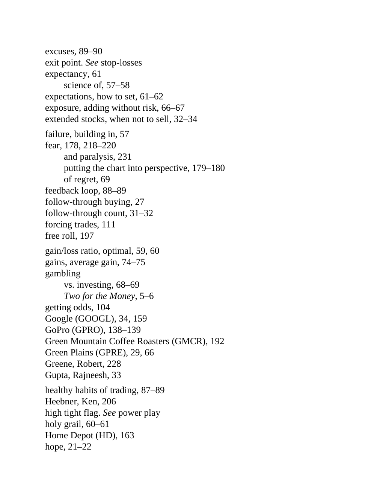

# Think and Trade Like a Champion - Page Image 202

## Source Page

Book: [[Think and Trade Like a Champion]]

## Page Read

Tags: risk-first, sell-or-failure, text-or-context-page

Concepts: [[Risk First]], [[Sell Rules and Failure Signals]]

This page is mainly text/context. It is included so the image index has complete source coverage, but it should not be treated as an independent chart pattern.

## Linked Stock Figures

- No extracted stock-figure case on this page.

## Extracted Page Text Signal

excuses, 89-90 exit point. See stop-losses expectancy, 61 science of, 57-58 expectations, how to set, 61-62 exposure, adding without risk, 66-67 extended stocks, when not to sell, 32-34 failure, building in, 57 fear, 178, 218-220 and paralysis, 231 putting the chart into perspective, 179-180 of regret, 69 feedback loop, 88-89 follow-through buying, 27 follow-through count, 31-32 forcing trades, 111 free roll, 197 gain/loss ratio, optimal, 59, 60 gains, average gain, 74-75 gambling vs. investing,...

## Manual Study Prompt

- What visual structure is the page trying to make obvious?
- Is the lesson about buying, avoiding, selling, or managing risk?
- If a ticker is not present, what generic behavior does the image teach?
- If a ticker is present, does the linked OHLCV rebuild confirm the same behavior?
