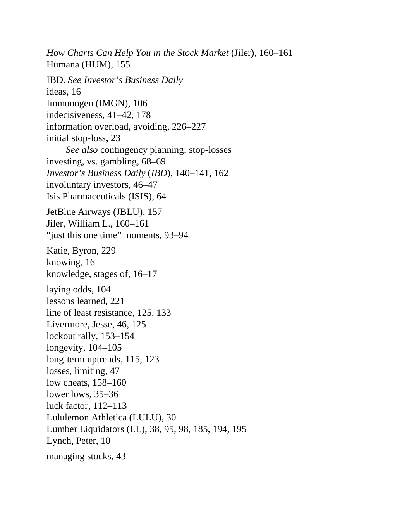

# Think and Trade Like a Champion - Page Image 203

## Source Page

Book: [[Think and Trade Like a Champion]]

## Page Read

Tags: risk-first, text-or-context-page

Concepts: [[Risk First]]

This page is mainly text/context. It is included so the image index has complete source coverage, but it should not be treated as an independent chart pattern.

## Linked Stock Figures

- No extracted stock-figure case on this page.

## Extracted Page Text Signal

How Charts Can Help You in the Stock Market (Jiler), 160-161 Humana (HUM), 155 IBD. See Investor’s Business Daily ideas, 16 Immunogen (IMGN), 106 indecisiveness, 41-42, 178 information overload, avoiding, 226-227 initial stop-loss, 23 See also contingency planning; stop-losses investing, vs. gambling, 68-69 Investor’s Business Daily (IBD), 140-141, 162 involuntary investors, 46-47 Isis Pharmaceuticals (ISIS), 64 JetBlue Airways (JBLU), 157 Jiler, William L., 160-161 “just this one time” moments,...

## Manual Study Prompt

- What visual structure is the page trying to make obvious?
- Is the lesson about buying, avoiding, selling, or managing risk?
- If a ticker is not present, what generic behavior does the image teach?
- If a ticker is present, does the linked OHLCV rebuild confirm the same behavior?
