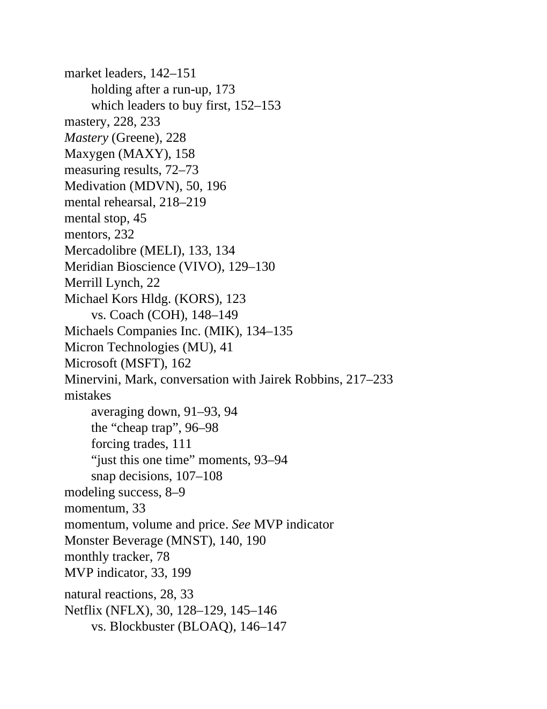

# Think and Trade Like a Champion - Page Image 204

## Source Page

Book: [[Think and Trade Like a Champion]]

## Page Read

Tags: mental-discipline, risk-first, text-or-context-page, volume-behavior

Concepts: [[Mental Discipline]], [[Risk First]], [[Volume Dry-Up and Accumulation]]

This page is mainly text/context. It is included so the image index has complete source coverage, but it should not be treated as an independent chart pattern.

## Linked Stock Figures

- No extracted stock-figure case on this page.

## Extracted Page Text Signal

market leaders, 142-151 holding after a run-up, 173 which leaders to buy first, 152-153 mastery, 228, 233 Mastery (Greene), 228 Maxygen (MAXY), 158 measuring results, 72-73 Medivation (MDVN), 50, 196 mental rehearsal, 218-219 mental stop, 45 mentors, 232 Mercadolibre (MELI), 133, 134 Meridian Bioscience (VIVO), 129-130 Merrill Lynch, 22 Michael Kors Hldg. (KORS), 123 vs. Coach (COH), 148-149 Michaels Companies Inc. (MIK), 134-135 Micron Technologies (MU), 41 Microsoft (MSFT), 162 Minervini, Mark...

## Manual Study Prompt

- What visual structure is the page trying to make obvious?
- Is the lesson about buying, avoiding, selling, or managing risk?
- If a ticker is not present, what generic behavior does the image teach?
- If a ticker is present, does the linked OHLCV rebuild confirm the same behavior?
