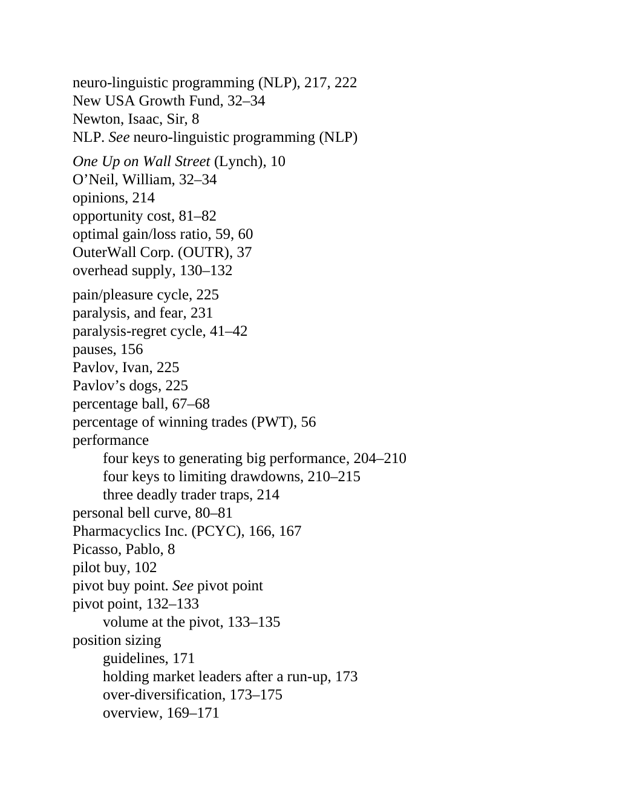

# Think and Trade Like a Champion - Page Image 205

## Source Page

Book: [[Think and Trade Like a Champion]]

## Page Read

Tags: pivot-or-entry, text-or-context-page, volume-behavior

Concepts: [[Pivot and Entry]], [[Volume Dry-Up and Accumulation]]

This page is mainly text/context. It is included so the image index has complete source coverage, but it should not be treated as an independent chart pattern.

## Linked Stock Figures

- No extracted stock-figure case on this page.

## Extracted Page Text Signal

neuro-linguistic programming (NLP), 217, 222 New USA Growth Fund, 32-34 Newton, Isaac, Sir, 8 NLP. See neuro-linguistic programming (NLP) One Up on Wall Street (Lynch), 10 O’Neil, William, 32-34 opinions, 214 opportunity cost, 81-82 optimal gain/loss ratio, 59, 60 OuterWall Corp. (OUTR), 37 overhead supply, 130-132 pain/pleasure cycle, 225 paralysis, and fear, 231 paralysis-regret cycle, 41-42 pauses, 156 Pavlov, Ivan, 225 Pavlov’s dogs, 225 percentage ball, 67-68 percentage of winning trades (P...

## Manual Study Prompt

- What visual structure is the page trying to make obvious?
- Is the lesson about buying, avoiding, selling, or managing risk?
- If a ticker is not present, what generic behavior does the image teach?
- If a ticker is present, does the linked OHLCV rebuild confirm the same behavior?
