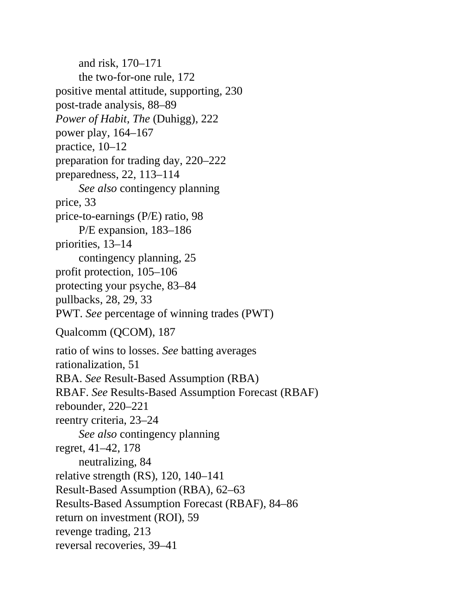

# Think and Trade Like a Champion - Page Image 206

## Source Page

Book: [[Think and Trade Like a Champion]]

## Page Read

Tags: relative-strength, risk-first, text-or-context-page

Concepts: [[Relative Strength Leadership]], [[Risk First]]

This page is mainly text/context. It is included so the image index has complete source coverage, but it should not be treated as an independent chart pattern.

## Linked Stock Figures

- No extracted stock-figure case on this page.

## Extracted Page Text Signal

and risk, 170-171 the two-for-one rule, 172 positive mental attitude, supporting, 230 post-trade analysis, 88-89 Power of Habit, The (Duhigg), 222 power play, 164-167 practice, 10-12 preparation for trading day, 220-222 preparedness, 22, 113-114 See also contingency planning price, 33 price-to-earnings (P/E) ratio, 98 P/E expansion, 183-186 priorities, 13-14 contingency planning, 25 profit protection, 105-106 protecting your psyche, 83-84 pullbacks, 28, 29, 33 PWT. See percentage of winning trad...

## Manual Study Prompt

- What visual structure is the page trying to make obvious?
- Is the lesson about buying, avoiding, selling, or managing risk?
- If a ticker is not present, what generic behavior does the image teach?
- If a ticker is present, does the linked OHLCV rebuild confirm the same behavior?
