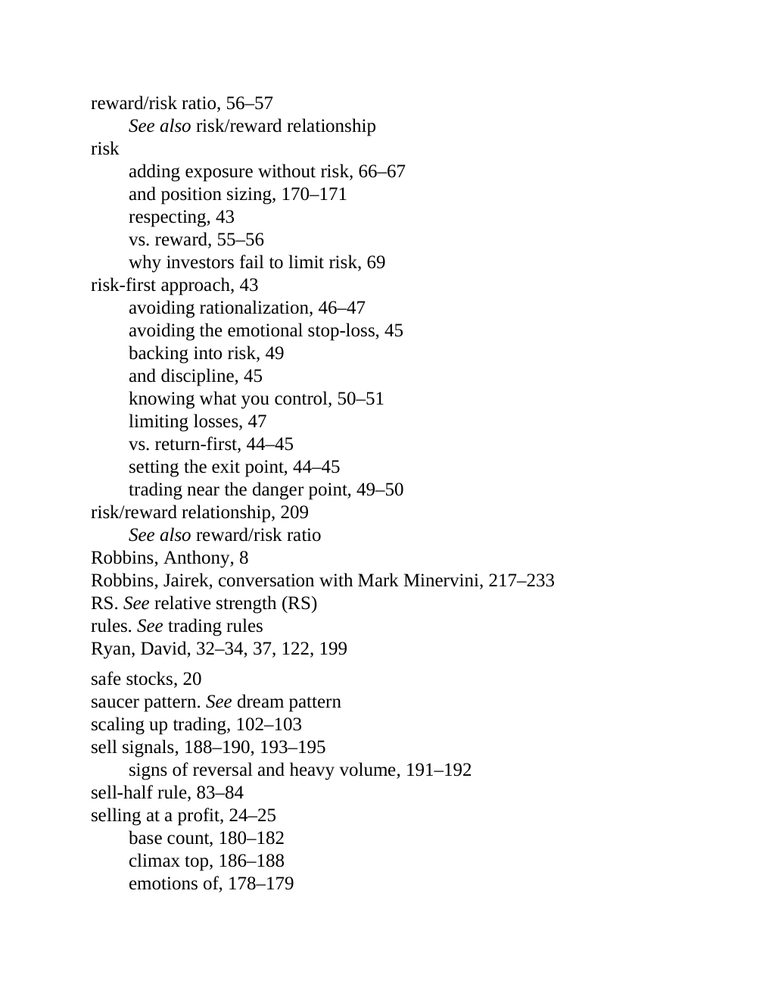

# Think and Trade Like a Champion - Page Image 207

## Source Page

Book: [[Think and Trade Like a Champion]]

## Page Read

Tags: mental-discipline, relative-strength, risk-first, sell-or-failure, text-or-context-page, volume-behavior

Concepts: [[Mental Discipline]], [[Relative Strength Leadership]], [[Risk First]], [[Sell Rules and Failure Signals]], [[Volume Dry-Up and Accumulation]]

This page is mainly text/context. It is included so the image index has complete source coverage, but it should not be treated as an independent chart pattern.

## Linked Stock Figures

- No extracted stock-figure case on this page.

## Extracted Page Text Signal

reward/risk ratio, 56-57 See also risk/reward relationship risk adding exposure without risk, 66-67 and position sizing, 170-171 respecting, 43 vs. reward, 55-56 why investors fail to limit risk, 69 risk-first approach, 43 avoiding rationalization, 46-47 avoiding the emotional stop-loss, 45 backing into risk, 49 and discipline, 45 knowing what you control, 50-51 limiting losses, 47 vs. return-first, 44-45 setting the exit point, 44-45 trading near the danger point, 49-50 risk/reward relationship...

## Manual Study Prompt

- What visual structure is the page trying to make obvious?
- Is the lesson about buying, avoiding, selling, or managing risk?
- If a ticker is not present, what generic behavior does the image teach?
- If a ticker is present, does the linked OHLCV rebuild confirm the same behavior?
