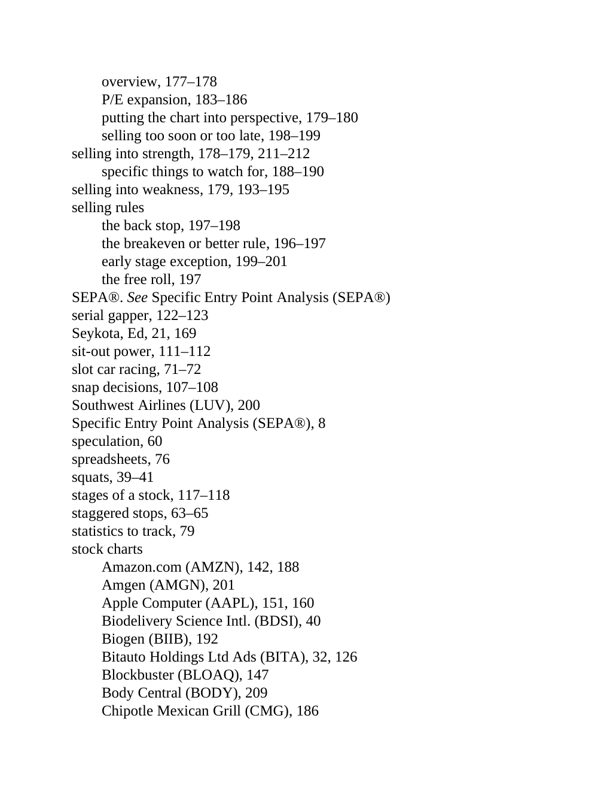

# Think and Trade Like a Champion - Page Image 208

## Source Page

Book: [[Think and Trade Like a Champion]]

## Page Read

Tags: ipo-or-new-issue, risk-first, sell-or-failure, text-or-context-page

Concepts: [[IPO Base New Issue Setup|IPO Base / New Issue Setup]], [[Risk First]], [[Sell Rules and Failure Signals]]

This page is mainly text/context. It is included so the image index has complete source coverage, but it should not be treated as an independent chart pattern.

## Linked Stock Figures

- No extracted stock-figure case on this page.

## Extracted Page Text Signal

overview, 177-178 P/E expansion, 183-186 putting the chart into perspective, 179-180 selling too soon or too late, 198-199 selling into strength, 178-179, 211-212 specific things to watch for, 188-190 selling into weakness, 179, 193-195 selling rules the back stop, 197-198 the breakeven or better rule, 196-197 early stage exception, 199-201 the free roll, 197 SEPA®. See Specific Entry Point Analysis (SEPA®) serial gapper, 122-123 Seykota, Ed, 21, 169 sit-out power, 111-112 slot car racing, 71-72...

## Manual Study Prompt

- What visual structure is the page trying to make obvious?
- Is the lesson about buying, avoiding, selling, or managing risk?
- If a ticker is not present, what generic behavior does the image teach?
- If a ticker is present, does the linked OHLCV rebuild confirm the same behavior?
