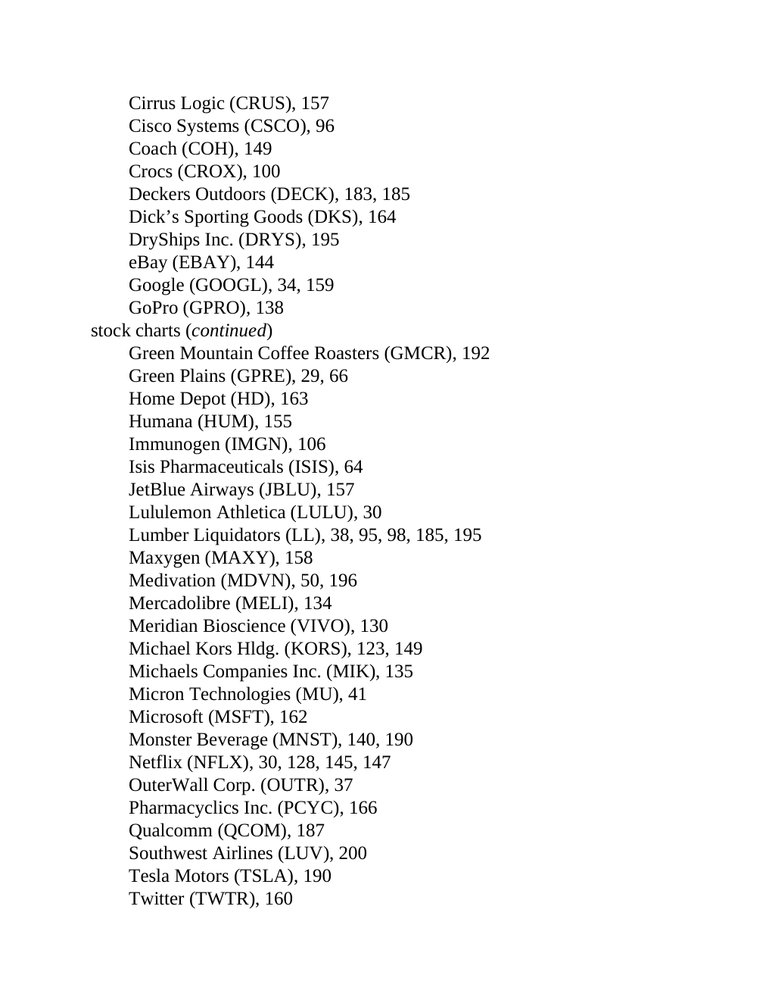

# Think and Trade Like a Champion - Page Image 209

## Source Page

Book: [[Think and Trade Like a Champion]]

## Page Read

Tags: text-or-context-page, volume-behavior

Concepts: [[Volume Dry-Up and Accumulation]]

This page is mainly text/context. It is included so the image index has complete source coverage, but it should not be treated as an independent chart pattern.

## Linked Stock Figures

- No extracted stock-figure case on this page.

## Extracted Page Text Signal

Cirrus Logic (CRUS), 157 Cisco Systems (CSCO), 96 Coach (COH), 149 Crocs (CROX), 100 Deckers Outdoors (DECK), 183, 185 Dick’s Sporting Goods (DKS), 164 DryShips Inc. (DRYS), 195 eBay (EBAY), 144 Google (GOOGL), 34, 159 GoPro (GPRO), 138 stock charts (continued) Green Mountain Coffee Roasters (GMCR), 192 Green Plains (GPRE), 29, 66 Home Depot (HD), 163 Humana (HUM), 155 Immunogen (IMGN), 106 Isis Pharmaceuticals (ISIS), 64 JetBlue Airways (JBLU), 157 Lululemon Athletica (LULU), 30 Lumber Liquidat...

## Manual Study Prompt

- What visual structure is the page trying to make obvious?
- Is the lesson about buying, avoiding, selling, or managing risk?
- If a ticker is not present, what generic behavior does the image teach?
- If a ticker is present, does the linked OHLCV rebuild confirm the same behavior?
