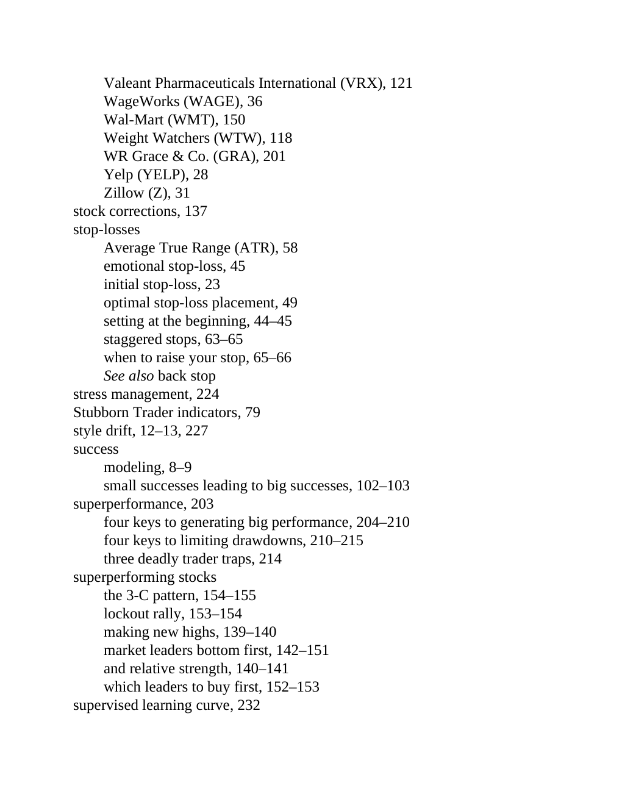

# Think and Trade Like a Champion - Page Image 210

## Source Page

Book: [[Think and Trade Like a Champion]]

## Page Read

Tags: relative-strength, risk-first, text-or-context-page

Concepts: [[Relative Strength Leadership]], [[Risk First]]

This page is mainly text/context. It is included so the image index has complete source coverage, but it should not be treated as an independent chart pattern.

## Linked Stock Figures

- No extracted stock-figure case on this page.

## Extracted Page Text Signal

Valeant Pharmaceuticals International (VRX), 121 WageWorks (WAGE), 36 Wal-Mart (WMT), 150 Weight Watchers (WTW), 118 WR Grace & Co. (GRA), 201 Yelp (YELP), 28 Zillow (Z), 31 stock corrections, 137 stop-losses Average True Range (ATR), 58 emotional stop-loss, 45 initial stop-loss, 23 optimal stop-loss placement, 49 setting at the beginning, 44-45 staggered stops, 63-65 when to raise your stop, 65-66 See also back stop stress management, 224 Stubborn Trader indicators, 79 style drift, 12-13, 227 s...

## Manual Study Prompt

- What visual structure is the page trying to make obvious?
- Is the lesson about buying, avoiding, selling, or managing risk?
- If a ticker is not present, what generic behavior does the image teach?
- If a ticker is present, does the linked OHLCV rebuild confirm the same behavior?
