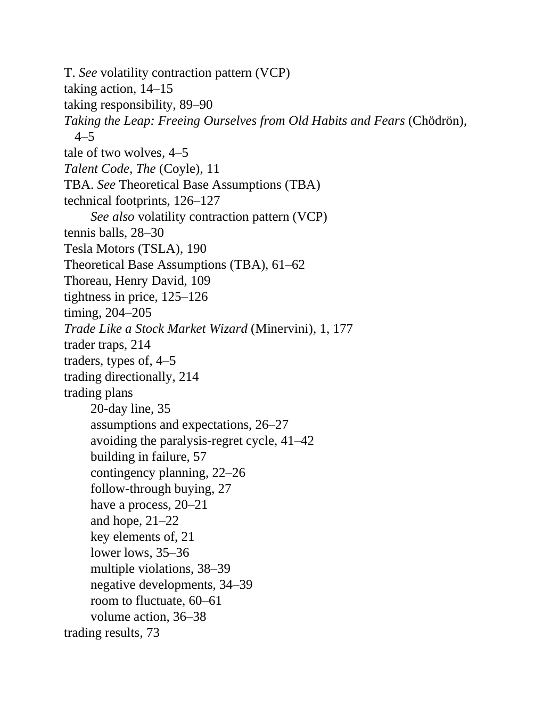

# Think and Trade Like a Champion - Page Image 211

## Source Page

Book: [[Think and Trade Like a Champion]]

## Page Read

Tags: sell-or-failure, text-or-context-page, vcp-or-tightening, volume-behavior

Concepts: [[Sell Rules and Failure Signals]], [[Volatility Contraction Pattern]], [[Volume Dry-Up and Accumulation]]

This page is mainly text/context. It is included so the image index has complete source coverage, but it should not be treated as an independent chart pattern.

## Linked Stock Figures

- No extracted stock-figure case on this page.

## Extracted Page Text Signal

T. See volatility contraction pattern (VCP) taking action, 14-15 taking responsibility, 89-90 Taking the Leap: Freeing Ourselves from Old Habits and Fears (Chödrön), 4-5 tale of two wolves, 4-5 Talent Code, The (Coyle), 11 TBA. See Theoretical Base Assumptions (TBA) technical footprints, 126-127 See also volatility contraction pattern (VCP) tennis balls, 28-30 Tesla Motors (TSLA), 190 Theoretical Base Assumptions (TBA), 61-62 Thoreau, Henry David, 109 tightness in price, 125-126 timing, 204-205 ...

## Manual Study Prompt

- What visual structure is the page trying to make obvious?
- Is the lesson about buying, avoiding, selling, or managing risk?
- If a ticker is not present, what generic behavior does the image teach?
- If a ticker is present, does the linked OHLCV rebuild confirm the same behavior?
