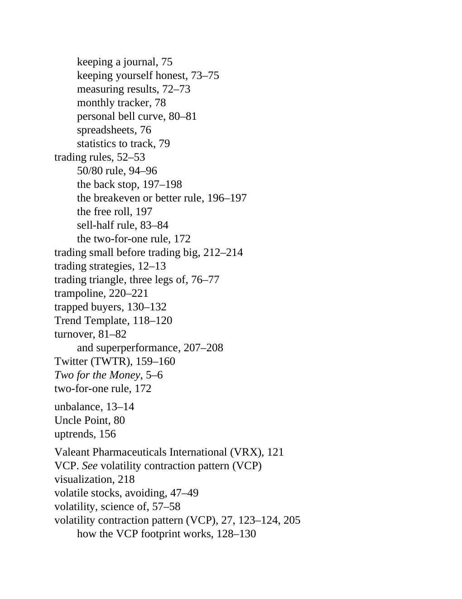

# Think and Trade Like a Champion - Page Image 212

## Source Page

Book: [[Think and Trade Like a Champion]]

## Page Read

Tags: risk-first, sell-or-failure, text-or-context-page, trend-template, vcp-or-tightening

Concepts: [[Risk First]], [[Sell Rules and Failure Signals]], [[Trend Template]], [[Volatility Contraction Pattern]]

This page is mainly text/context. It is included so the image index has complete source coverage, but it should not be treated as an independent chart pattern.

## Linked Stock Figures

- No extracted stock-figure case on this page.

## Extracted Page Text Signal

keeping a journal, 75 keeping yourself honest, 73-75 measuring results, 72-73 monthly tracker, 78 personal bell curve, 80-81 spreadsheets, 76 statistics to track, 79 trading rules, 52-53 50/80 rule, 94-96 the back stop, 197-198 the breakeven or better rule, 196-197 the free roll, 197 sell-half rule, 83-84 the two-for-one rule, 172 trading small before trading big, 212-214 trading strategies, 12-13 trading triangle, three legs of, 76-77 trampoline, 220-221 trapped buyers, 130-132 Trend Template, ...

## Manual Study Prompt

- What visual structure is the page trying to make obvious?
- Is the lesson about buying, avoiding, selling, or managing risk?
- If a ticker is not present, what generic behavior does the image teach?
- If a ticker is present, does the linked OHLCV rebuild confirm the same behavior?
