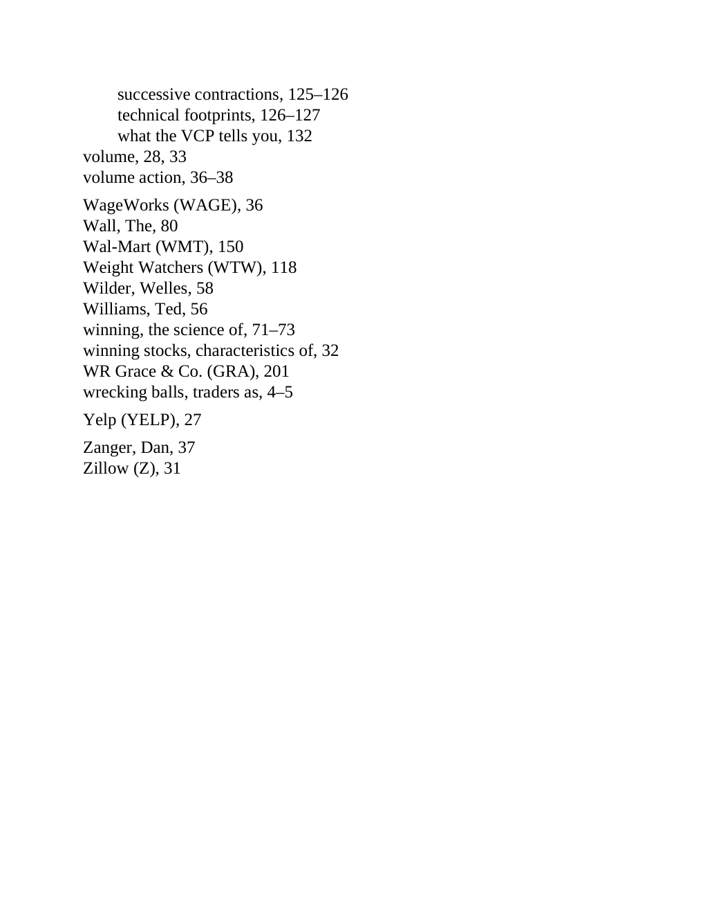

# Think and Trade Like a Champion - Page Image 213

## Source Page

Book: [[Think and Trade Like a Champion]]

## Page Read

Tags: text-or-context-page, vcp-or-tightening, volume-behavior

Concepts: [[Volatility Contraction Pattern]], [[Volume Dry-Up and Accumulation]]

This page is mainly text/context. It is included so the image index has complete source coverage, but it should not be treated as an independent chart pattern.

## Linked Stock Figures

- No extracted stock-figure case on this page.

## Extracted Page Text Signal

successive contractions, 125-126 technical footprints, 126-127 what the VCP tells you, 132 volume, 28, 33 volume action, 36-38 WageWorks (WAGE), 36 Wall, The, 80 Wal-Mart (WMT), 150 Weight Watchers (WTW), 118 Wilder, Welles, 58 Williams, Ted, 56 winning, the science of, 71-73 winning stocks, characteristics of, 32 WR Grace & Co. (GRA), 201 wrecking balls, traders as, 4-5 Yelp (YELP), 27 Zanger, Dan, 37 Zillow (Z), 31

## Manual Study Prompt

- What visual structure is the page trying to make obvious?
- Is the lesson about buying, avoiding, selling, or managing risk?
- If a ticker is not present, what generic behavior does the image teach?
- If a ticker is present, does the linked OHLCV rebuild confirm the same behavior?
