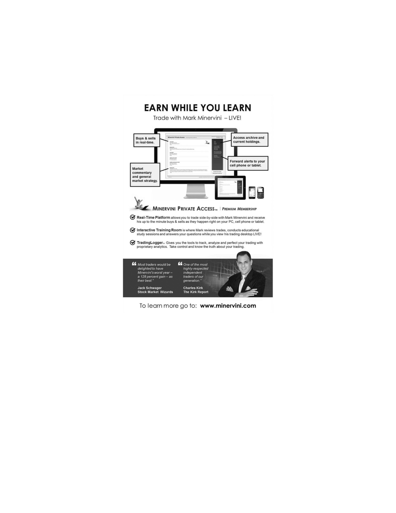

# Think and Trade Like a Champion - Page Image 216

## Source Page

Book: [[Think and Trade Like a Champion]]

## Page Read

Tags: visual-concept-page

Concepts: [[Mental Discipline]]

This is a visual teaching page without a clean ticker/date case. The useful work is to read the image as a concept illustration rather than forcing a market-data reconstruction.

## Linked Stock Figures

- No extracted stock-figure case on this page.

## Extracted Page Text Signal

_No extractable page text._

## Manual Study Prompt

- What visual structure is the page trying to make obvious?
- Is the lesson about buying, avoiding, selling, or managing risk?
- If a ticker is not present, what generic behavior does the image teach?
- If a ticker is present, does the linked OHLCV rebuild confirm the same behavior?
