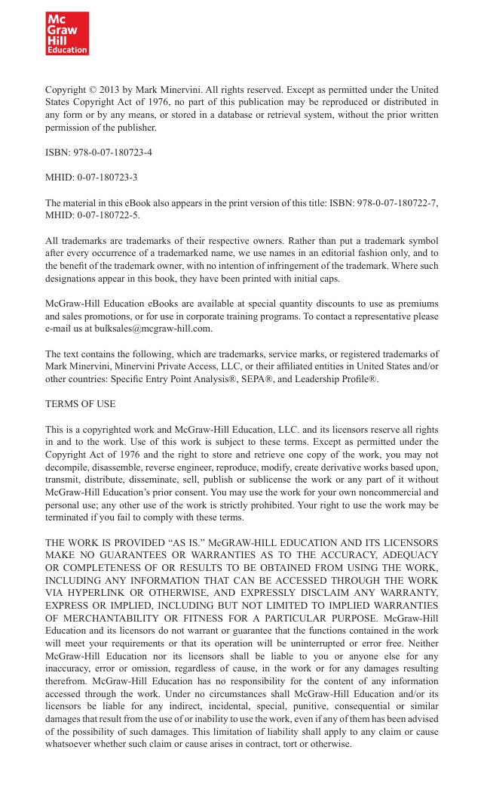

# Trade Like a Stock Market Wizard - Page Image 5

## Source Page

Book: [[Trade Like a Stock Market Wizard]]

## Page Read

Tags: visual-concept-page

Concepts: [[Mental Discipline]]

This is a visual teaching page without a clean ticker/date case. The useful work is to read the image as a concept illustration rather than forcing a market-data reconstruction.

## Linked Stock Figures

- No extracted stock-figure case on this page.

## Extracted Page Text Signal

Copyright © 2013 by Mark Minervini. All rights reserved. Except as permitted under the United States Copyright Act of 1976, no part of this publication may be reproduced or distributed in any form or by any means, or stored in a database or retrieval system, without the prior written permission of the publisher. ISBN: 978-0-07-180723-4 MHID: 0-07-180723-3 The material in this eBook also appears in the print version of this title: ISBN: 978-0-07-180722-7, MHID: 0-07-180722-5. All trademarks are t...

## Manual Study Prompt

- What visual structure is the page trying to make obvious?
- Is the lesson about buying, avoiding, selling, or managing risk?
- If a ticker is not present, what generic behavior does the image teach?
- If a ticker is present, does the linked OHLCV rebuild confirm the same behavior?
