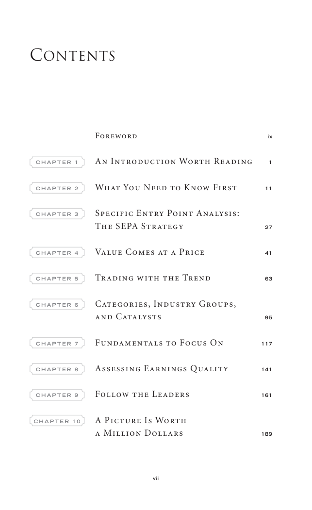

# Trade Like a Stock Market Wizard - Page Image 8

## Source Page

Book: [[Trade Like a Stock Market Wizard]]

## Page Read

Tags: visual-concept-page

Concepts: [[Mental Discipline]]

This is a visual teaching page without a clean ticker/date case. The useful work is to read the image as a concept illustration rather than forcing a market-data reconstruction.

## Linked Stock Figures

- No extracted stock-figure case on this page.

## Extracted Page Text Signal

Contents Foreword ix C H A P T E R 1 An Introduction Worth Reading 1 C H A P T E R 2 What You Need to Know First 11 C H A P T E R 3 Specific Entry Point Analysis: The SEPA Strategy 27 C H A P T E R 4 Value Comes at a Price 41 C H A P T E R 5 Trading with the Trend 63 C H A P T E R 6 Categories, Industry Groups, and Catalysts 95 C H A P T E R 7 Fundamentals to Focus On 117 C H A P T E R 8 Assessing Earnings Quality 141 C H A P T E R 9 Follow the Leaders 161 C H A P T E R 1 0 A Picture Is Worth a ...

## Manual Study Prompt

- What visual structure is the page trying to make obvious?
- Is the lesson about buying, avoiding, selling, or managing risk?
- If a ticker is not present, what generic behavior does the image teach?
- If a ticker is present, does the linked OHLCV rebuild confirm the same behavior?
