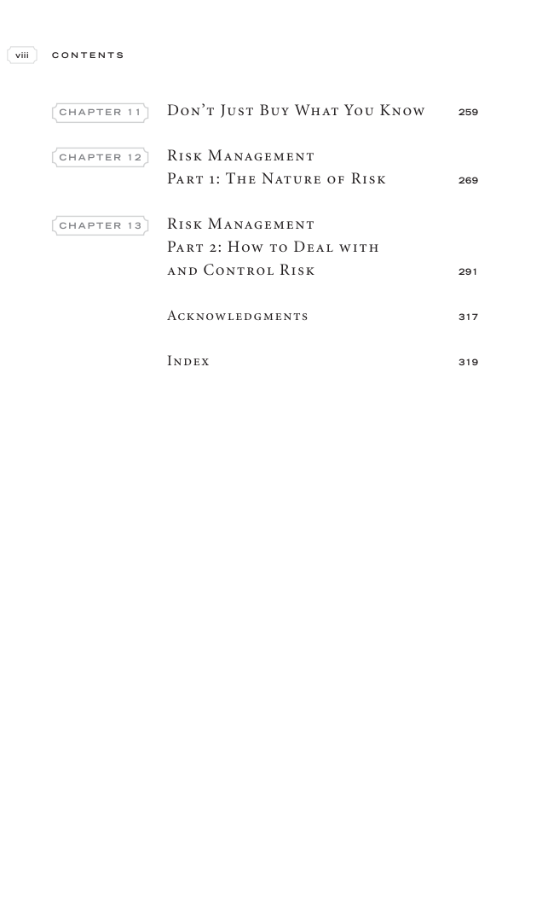

# Trade Like a Stock Market Wizard - Page Image 9

## Source Page

Book: [[Trade Like a Stock Market Wizard]]

## Page Read

Tags: risk-first, visual-concept-page

Concepts: [[Mental Discipline]], [[Risk First]]

This is a visual teaching page without a clean ticker/date case. The useful work is to read the image as a concept illustration rather than forcing a market-data reconstruction.

## Linked Stock Figures

- No extracted stock-figure case on this page.

## Extracted Page Text Signal

viii C O N T E N T S C H A P T E R 1 1 Don’t Just Buy What You Know 259 C H A P T E R 1 2 Risk Management Part 1: The Nature of Risk 269 C H A P T E R 1 3 Risk Management Part 2: How to Deal with and Control Risk 291 Acknowledgments 317 Index 319

## Manual Study Prompt

- What visual structure is the page trying to make obvious?
- Is the lesson about buying, avoiding, selling, or managing risk?
- If a ticker is not present, what generic behavior does the image teach?
- If a ticker is present, does the linked OHLCV rebuild confirm the same behavior?
