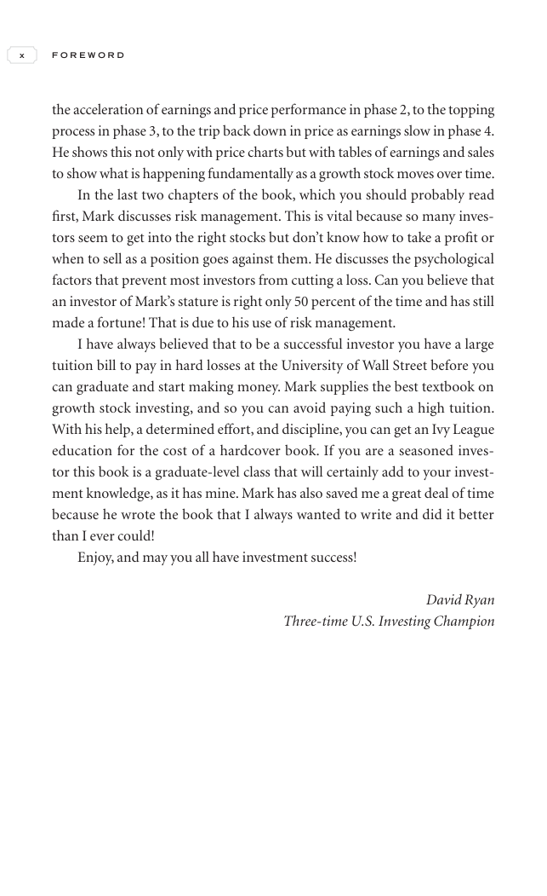

# Trade Like a Stock Market Wizard - Page Image 11

## Source Page

Book: [[Trade Like a Stock Market Wizard]]

## Page Read

Tags: mental-discipline, risk-first, sell-or-failure, visual-concept-page

Concepts: [[Mental Discipline]], [[Risk First]], [[Sell Rules and Failure Signals]]

This is a visual teaching page without a clean ticker/date case. The useful work is to read the image as a concept illustration rather than forcing a market-data reconstruction.

## Linked Stock Figures

- No extracted stock-figure case on this page.

## Extracted Page Text Signal

x F O R E W O R D the acceleration of earnings and price performance in phase 2, to the topping process in phase 3, to the trip back down in price as earnings slow in phase 4. He shows this not only with price charts but with tables of earnings and sales to show what is happening fundamentally as a growth stock moves over time. In the last two chapters of the book, which you should probably read first, Mark discusses risk management. This is vital because so many inves- tors seem to get into the ...

## Manual Study Prompt

- What visual structure is the page trying to make obvious?
- Is the lesson about buying, avoiding, selling, or managing risk?
- If a ticker is not present, what generic behavior does the image teach?
- If a ticker is present, does the linked OHLCV rebuild confirm the same behavior?
