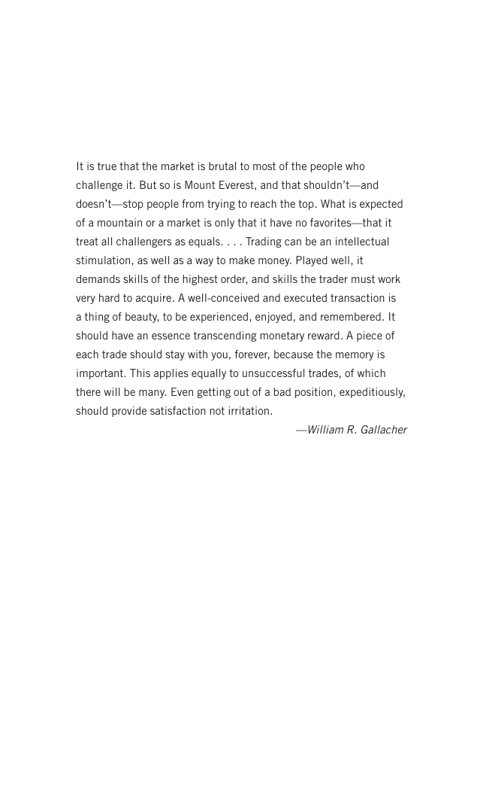

# Trade Like a Stock Market Wizard - Page Image 12

## Source Page

Book: [[Trade Like a Stock Market Wizard]]

## Page Read

Tags: risk-first, visual-concept-page

Concepts: [[Mental Discipline]], [[Risk First]]

This is a visual teaching page without a clean ticker/date case. The useful work is to read the image as a concept illustration rather than forcing a market-data reconstruction.

## Linked Stock Figures

- No extracted stock-figure case on this page.

## Extracted Page Text Signal

It is true that the market is brutal to most of the people who challenge it. But so is Mount Everest, and that shouldn’t-and doesn’t-stop people from trying to reach the top. What is expected of a mountain or a market is only that it have no favorites-that it treat all challengers as equals. . . . Trading can be an intellectual stimulation, as well as a way to make money. Played well, it demands skills of the highest order, and skills the trader must work very hard to acquire. A well-conceived a...

## Manual Study Prompt

- What visual structure is the page trying to make obvious?
- Is the lesson about buying, avoiding, selling, or managing risk?
- If a ticker is not present, what generic behavior does the image teach?
- If a ticker is present, does the linked OHLCV rebuild confirm the same behavior?
