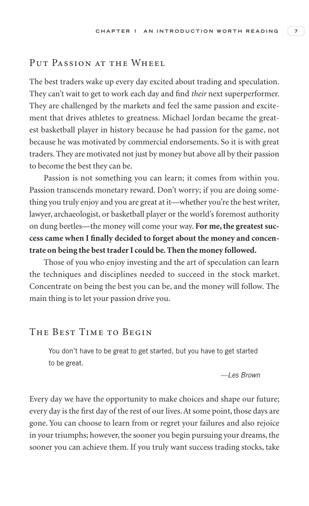

# Trade Like a Stock Market Wizard - Page Image 22

## Source Page

Book: [[Trade Like a Stock Market Wizard]]

## Page Read

Tags: mental-discipline, visual-concept-page

Concepts: [[Mental Discipline]]

This is a visual teaching page without a clean ticker/date case. The useful work is to read the image as a concept illustration rather than forcing a market-data reconstruction.

## Linked Stock Figures

- No extracted stock-figure case on this page.

## Extracted Page Text Signal

C H A P T E R 1 A N I N T R O D U C T I O N W O R T H R E A D I N G 7 Put Passion at the Wheel The best traders wake up every day excited about trading and speculation. They can’t wait to get to work each day and find their next superperformer. They are challenged by the markets and feel the same passion and excite- ment that drives athletes to greatness. Michael Jordan became the great- est basketball player in history because he had passion for the game, not because he was motivated by commerci...

## Manual Study Prompt

- What visual structure is the page trying to make obvious?
- Is the lesson about buying, avoiding, selling, or managing risk?
- If a ticker is not present, what generic behavior does the image teach?
- If a ticker is present, does the linked OHLCV rebuild confirm the same behavior?
