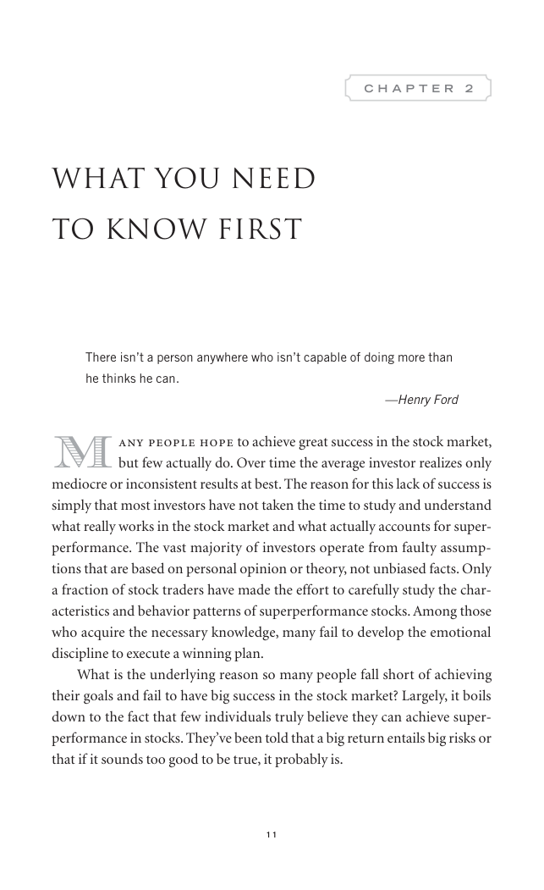

# Trade Like a Stock Market Wizard - Page Image 26

## Source Page

Book: [[Trade Like a Stock Market Wizard]]

## Page Read

Tags: mental-discipline, risk-first, visual-concept-page

Concepts: [[Mental Discipline]], [[Risk First]]

This is a visual teaching page without a clean ticker/date case. The useful work is to read the image as a concept illustration rather than forcing a market-data reconstruction.

## Linked Stock Figures

- No extracted stock-figure case on this page.

## Extracted Page Text Signal

11 C H A P T E R 2 What You Need to Know First There isn’t a person anywhere who isn’t capable of doing more than he thinks he can. -Henry Ford M any people hope to achieve great success in the stock market, but few actually do. Over time the average investor realizes only mediocre or inconsistent results at best. The reason for this lack of success is simply that most investors have not taken the time to study and understand what really works in the stock market and what actually accounts for s...

## Manual Study Prompt

- What visual structure is the page trying to make obvious?
- Is the lesson about buying, avoiding, selling, or managing risk?
- If a ticker is not present, what generic behavior does the image teach?
- If a ticker is present, does the linked OHLCV rebuild confirm the same behavior?
