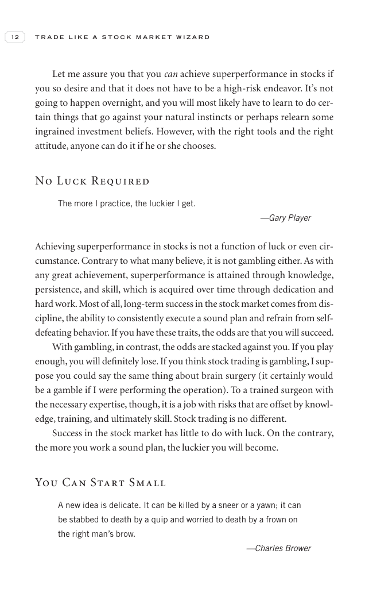

# Trade Like a Stock Market Wizard - Page Image 27

## Source Page

Book: [[Trade Like a Stock Market Wizard]]

## Page Read

Tags: risk-first, visual-concept-page

Concepts: [[Mental Discipline]], [[Risk First]]

This is a visual teaching page without a clean ticker/date case. The useful work is to read the image as a concept illustration rather than forcing a market-data reconstruction.

## Linked Stock Figures

- No extracted stock-figure case on this page.

## Extracted Page Text Signal

12 T R A D E L I K E A S T O C K M A R K E T W I Z A R D Let me assure you that you can achieve superperformance in stocks if you so desire and that it does not have to be a high-risk endeavor. It’s not going to happen overnight, and you will most likely have to learn to do cer- tain things that go against your natural instincts or perhaps relearn some ingrained investment beliefs. However, with the right tools and the right attitude, anyone can do it if he or she chooses. No Luck Required The m...

## Manual Study Prompt

- What visual structure is the page trying to make obvious?
- Is the lesson about buying, avoiding, selling, or managing risk?
- If a ticker is not present, what generic behavior does the image teach?
- If a ticker is present, does the linked OHLCV rebuild confirm the same behavior?
