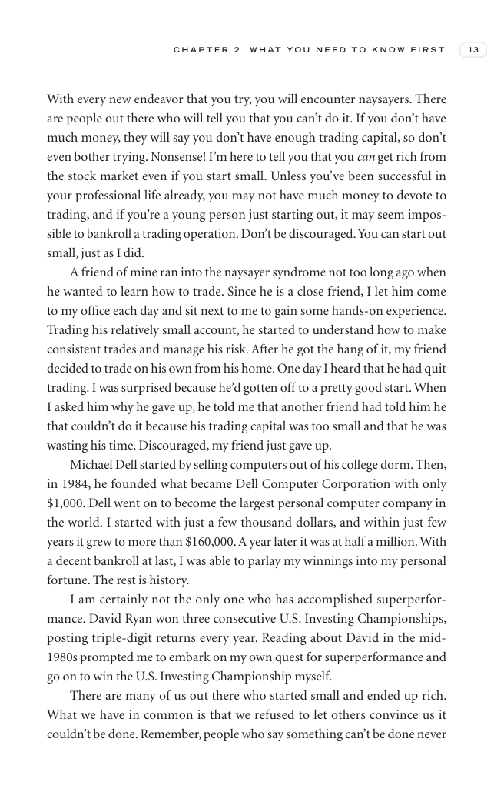

# Trade Like a Stock Market Wizard - Page Image 28

## Source Page

Book: [[Trade Like a Stock Market Wizard]]

## Page Read

Tags: risk-first, sell-or-failure, visual-concept-page

Concepts: [[Mental Discipline]], [[Risk First]], [[Sell Rules and Failure Signals]]

This is a visual teaching page without a clean ticker/date case. The useful work is to read the image as a concept illustration rather than forcing a market-data reconstruction.

## Linked Stock Figures

- No extracted stock-figure case on this page.

## Extracted Page Text Signal

C H A P T E R 2 W H A T Y O U N E E D T O K N O W F I R S T 13 With every new endeavor that you try, you will encounter naysayers. There are people out there who will tell you that you can’t do it. If you don’t have much money, they will say you don’t have enough trading capital, so don’t even bother trying. Nonsense! I’m here to tell you that you can get rich from the stock market even if you start small. Unless you’ve been successful in your professional life already, you may not have much mon...

## Manual Study Prompt

- What visual structure is the page trying to make obvious?
- Is the lesson about buying, avoiding, selling, or managing risk?
- If a ticker is not present, what generic behavior does the image teach?
- If a ticker is present, does the linked OHLCV rebuild confirm the same behavior?
