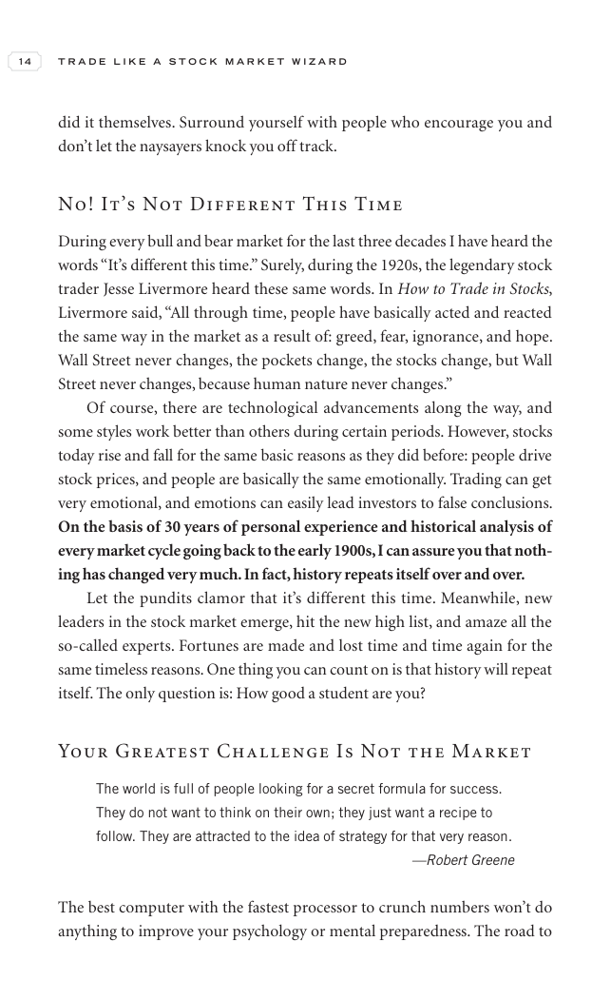

# Trade Like a Stock Market Wizard - Page Image 29

## Source Page

Book: [[Trade Like a Stock Market Wizard]]

## Page Read

Tags: visual-concept-page

Concepts: [[Mental Discipline]]

This is a visual teaching page without a clean ticker/date case. The useful work is to read the image as a concept illustration rather than forcing a market-data reconstruction.

## Linked Stock Figures

- No extracted stock-figure case on this page.

## Extracted Page Text Signal

14 T R A D E L I K E A S T O C K M A R K E T W I Z A R D did it themselves. Surround yourself with people who encourage you and don’t let the naysayers knock you off track. No! It’s Not Different This Time During every bull and bear market for the last three decades I have heard the words “It’s different this time.” Surely, during the 1920s, the legendary stock trader Jesse Livermore heard these same words. In How to Trade in Stocks, Livermore said, “All through time, people have basically acted...

## Manual Study Prompt

- What visual structure is the page trying to make obvious?
- Is the lesson about buying, avoiding, selling, or managing risk?
- If a ticker is not present, what generic behavior does the image teach?
- If a ticker is present, does the linked OHLCV rebuild confirm the same behavior?
