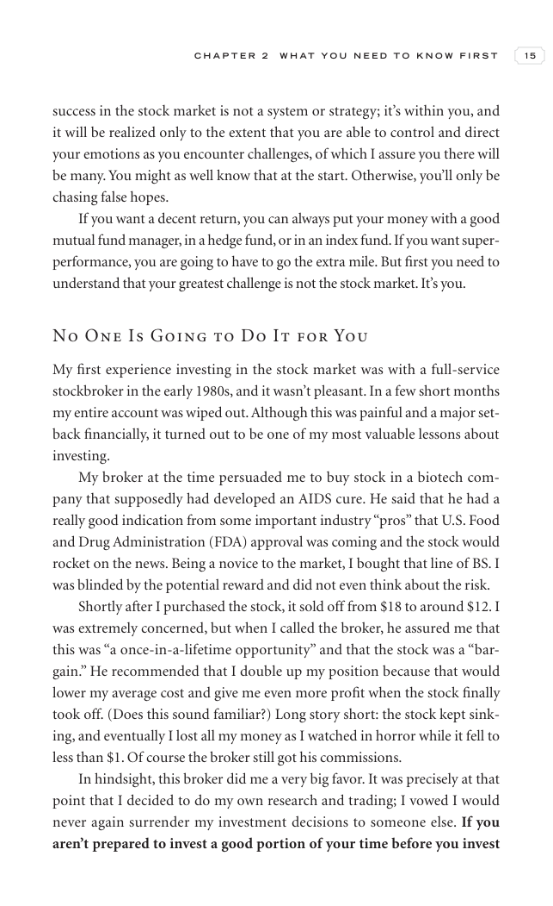

# Trade Like a Stock Market Wizard - Page Image 30

## Source Page

Book: [[Trade Like a Stock Market Wizard]]

## Page Read

Tags: risk-first, visual-concept-page

Concepts: [[Mental Discipline]], [[Risk First]]

This is a visual teaching page without a clean ticker/date case. The useful work is to read the image as a concept illustration rather than forcing a market-data reconstruction.

## Linked Stock Figures

- No extracted stock-figure case on this page.

## Extracted Page Text Signal

C H A P T E R 2 W H A T Y O U N E E D T O K N O W F I R S T 15 success in the stock market is not a system or strategy; it’s within you, and it will be realized only to the extent that you are able to control and direct your emotions as you encounter challenges, of which I assure you there will be many. You might as well know that at the start. Otherwise, you’ll only be chasing false hopes. If you want a decent return, you can always put your money with a good mutual fund manager, in a hedge fun...

## Manual Study Prompt

- What visual structure is the page trying to make obvious?
- Is the lesson about buying, avoiding, selling, or managing risk?
- If a ticker is not present, what generic behavior does the image teach?
- If a ticker is present, does the linked OHLCV rebuild confirm the same behavior?
