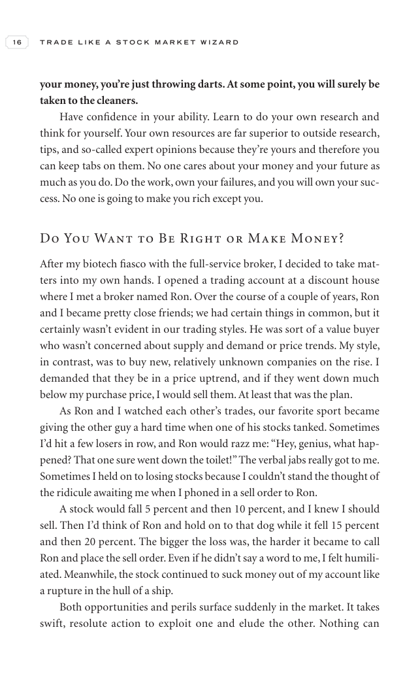

# Trade Like a Stock Market Wizard - Page Image 31

## Source Page

Book: [[Trade Like a Stock Market Wizard]]

## Page Read

Tags: sell-or-failure, visual-concept-page

Concepts: [[Mental Discipline]], [[Sell Rules and Failure Signals]]

This is a visual teaching page without a clean ticker/date case. The useful work is to read the image as a concept illustration rather than forcing a market-data reconstruction.

## Linked Stock Figures

- No extracted stock-figure case on this page.

## Extracted Page Text Signal

16 T R A D E L I K E A S T O C K M A R K E T W I Z A R D your money, you’re just throwing darts. At some point, you will surely be taken to the cleaners. Have confidence in your ability. Learn to do your own research and think for yourself. Your own resources are far superior to outside research, tips, and so-called expert opinions because they’re yours and therefore you can keep tabs on them. No one cares about your money and your future as much as you do. Do the work, own your failures, and you...

## Manual Study Prompt

- What visual structure is the page trying to make obvious?
- Is the lesson about buying, avoiding, selling, or managing risk?
- If a ticker is not present, what generic behavior does the image teach?
- If a ticker is present, does the linked OHLCV rebuild confirm the same behavior?
