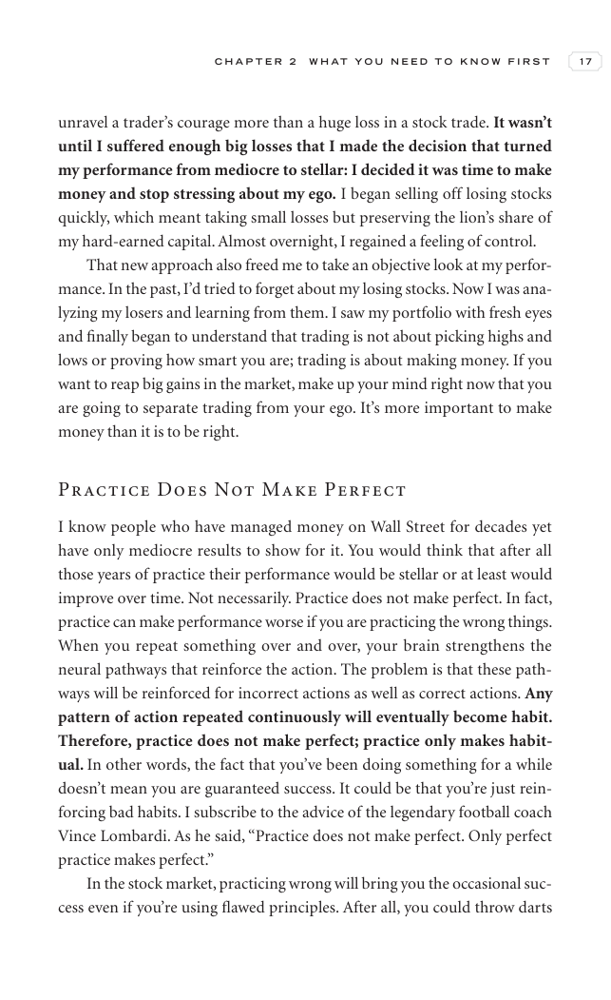

# Trade Like a Stock Market Wizard - Page Image 32

## Source Page

Book: [[Trade Like a Stock Market Wizard]]

## Page Read

Tags: risk-first, sell-or-failure, visual-concept-page

Concepts: [[Mental Discipline]], [[Risk First]], [[Sell Rules and Failure Signals]]

This is a visual teaching page without a clean ticker/date case. The useful work is to read the image as a concept illustration rather than forcing a market-data reconstruction.

## Linked Stock Figures

- No extracted stock-figure case on this page.

## Extracted Page Text Signal

C H A P T E R 2 W H A T Y O U N E E D T O K N O W F I R S T 17 unravel a trader’s courage more than a huge loss in a stock trade. It wasn’t until I suffered enough big losses that I made the decision that turned my performance from mediocre to stellar: I decided it was time to make money and stop stressing about my ego. I began selling off losing stocks quickly, which meant taking small losses but preserving the lion’s share of my hard-earned capital. Almost overnight, I regained a feeling of co...

## Manual Study Prompt

- What visual structure is the page trying to make obvious?
- Is the lesson about buying, avoiding, selling, or managing risk?
- If a ticker is not present, what generic behavior does the image teach?
- If a ticker is present, does the linked OHLCV rebuild confirm the same behavior?
