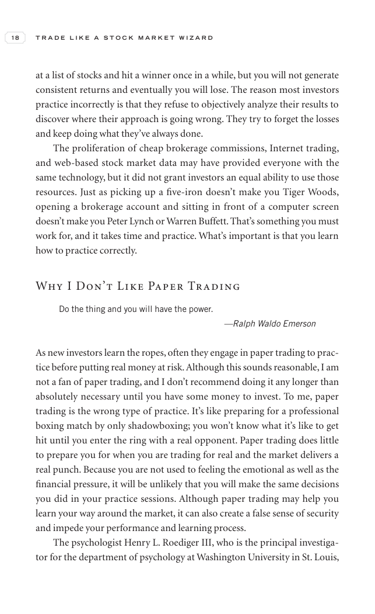

# Trade Like a Stock Market Wizard - Page Image 33

## Source Page

Book: [[Trade Like a Stock Market Wizard]]

## Page Read

Tags: risk-first, visual-concept-page

Concepts: [[Mental Discipline]], [[Risk First]]

This is a visual teaching page without a clean ticker/date case. The useful work is to read the image as a concept illustration rather than forcing a market-data reconstruction.

## Linked Stock Figures

- No extracted stock-figure case on this page.

## Extracted Page Text Signal

18 T R A D E L I K E A S T O C K M A R K E T W I Z A R D at a list of stocks and hit a winner once in a while, but you will not generate consistent returns and eventually you will lose. The reason most investors practice incorrectly is that they refuse to objectively analyze their results to discover where their approach is going wrong. They try to forget the losses and keep doing what they’ve always done. The proliferation of cheap brokerage commissions, Internet trading, and web-based stock ma...

## Manual Study Prompt

- What visual structure is the page trying to make obvious?
- Is the lesson about buying, avoiding, selling, or managing risk?
- If a ticker is not present, what generic behavior does the image teach?
- If a ticker is present, does the linked OHLCV rebuild confirm the same behavior?
