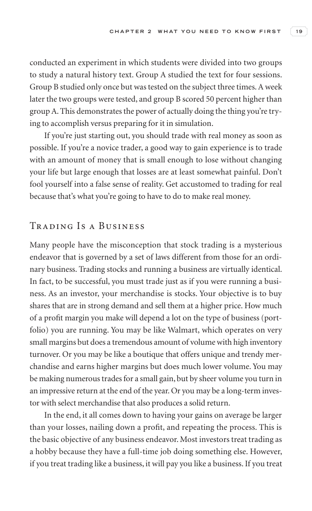

# Trade Like a Stock Market Wizard - Page Image 34

## Source Page

Book: [[Trade Like a Stock Market Wizard]]

## Page Read

Tags: sell-or-failure, visual-concept-page

Concepts: [[Mental Discipline]], [[Sell Rules and Failure Signals]]

This is a visual teaching page without a clean ticker/date case. The useful work is to read the image as a concept illustration rather than forcing a market-data reconstruction.

## Linked Stock Figures

- No extracted stock-figure case on this page.

## Extracted Page Text Signal

C H A P T E R 2 W H A T Y O U N E E D T O K N O W F I R S T 19 conducted an experiment in which students were divided into two groups to study a natural history text. Group A studied the text for four sessions. Group B studied only once but was tested on the subject three times. A week later the two groups were tested, and group B scored 50 percent higher than group A. This demonstrates the power of actually doing the thing you’re try- ing to accomplish versus preparing for it in simulation. If ...

## Manual Study Prompt

- What visual structure is the page trying to make obvious?
- Is the lesson about buying, avoiding, selling, or managing risk?
- If a ticker is not present, what generic behavior does the image teach?
- If a ticker is present, does the linked OHLCV rebuild confirm the same behavior?
