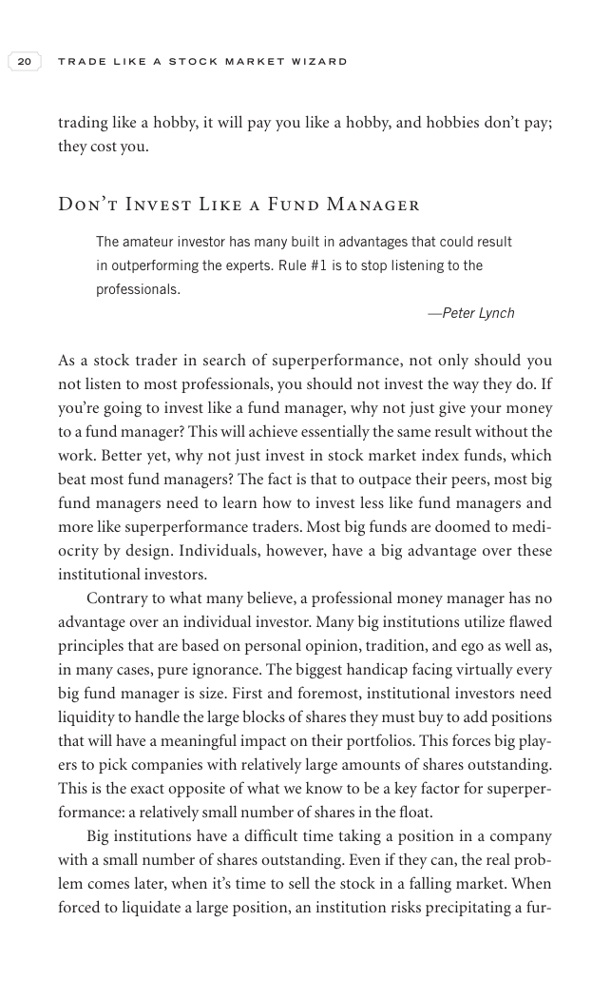

# Trade Like a Stock Market Wizard - Page Image 35

## Source Page

Book: [[Trade Like a Stock Market Wizard]]

## Page Read

Tags: risk-first, visual-concept-page

Concepts: [[Mental Discipline]], [[Risk First]]

This is a visual teaching page without a clean ticker/date case. The useful work is to read the image as a concept illustration rather than forcing a market-data reconstruction.

## Linked Stock Figures

- No extracted stock-figure case on this page.

## Extracted Page Text Signal

20 T R A D E L I K E A S T O C K M A R K E T W I Z A R D trading like a hobby, it will pay you like a hobby, and hobbies don’t pay; they cost you. Don’t Invest Like a Fund Manager The amateur investor has many built in advantages that could result in outperforming the experts. Rule #1 is to stop listening to the professionals. -Peter Lynch As a stock trader in search of superperformance, not only should you not listen to most professionals, you should not invest the way they do. If you’re going ...

## Manual Study Prompt

- What visual structure is the page trying to make obvious?
- Is the lesson about buying, avoiding, selling, or managing risk?
- If a ticker is not present, what generic behavior does the image teach?
- If a ticker is present, does the linked OHLCV rebuild confirm the same behavior?
