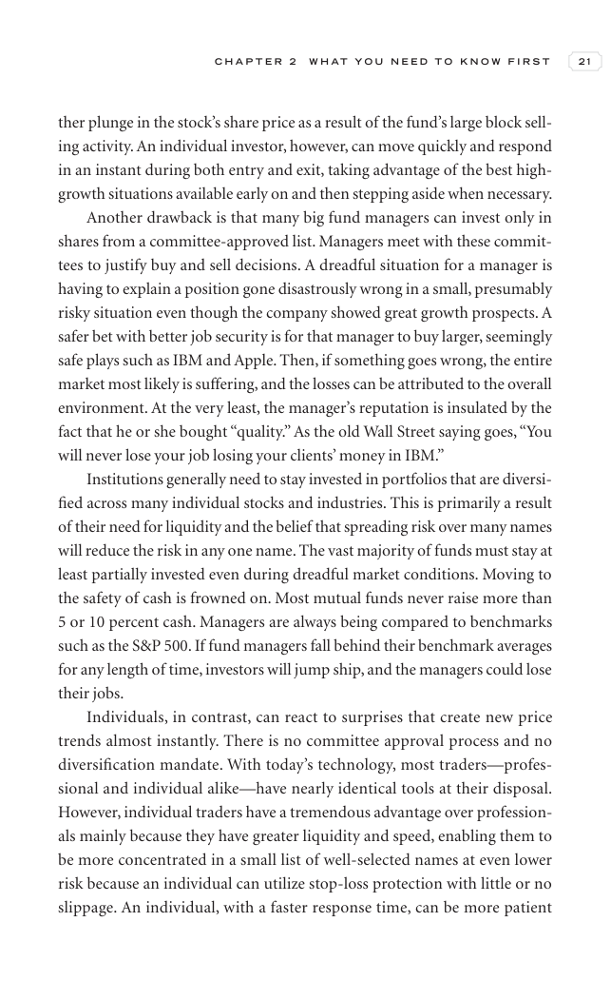

# Trade Like a Stock Market Wizard - Page Image 36

## Source Page

Book: [[Trade Like a Stock Market Wizard]]

## Page Read

Tags: risk-first, sell-or-failure, visual-concept-page

Concepts: [[Mental Discipline]], [[Risk First]], [[Sell Rules and Failure Signals]]

This is a visual teaching page without a clean ticker/date case. The useful work is to read the image as a concept illustration rather than forcing a market-data reconstruction.

## Linked Stock Figures

- No extracted stock-figure case on this page.

## Extracted Page Text Signal

C H A P T E R 2 W H A T Y O U N E E D T O K N O W F I R S T 21 ther plunge in the stock’s share price as a result of the fund’s large block sell- ing activity. An individual investor, however, can move quickly and respond in an instant during both entry and exit, taking advantage of the best high- growth situations available early on and then stepping aside when necessary. Another drawback is that many big fund managers can invest only in shares from a committee-approved list. Managers meet with...

## Manual Study Prompt

- What visual structure is the page trying to make obvious?
- Is the lesson about buying, avoiding, selling, or managing risk?
- If a ticker is not present, what generic behavior does the image teach?
- If a ticker is present, does the linked OHLCV rebuild confirm the same behavior?
