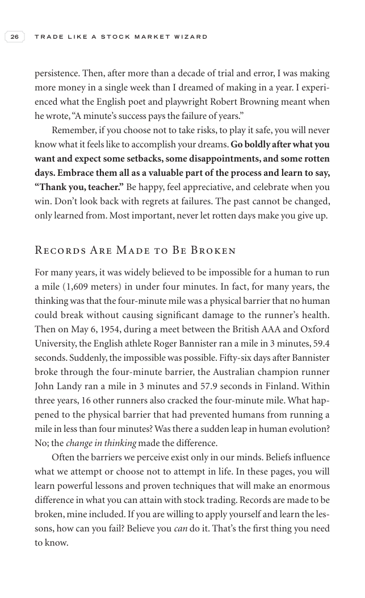

# Trade Like a Stock Market Wizard - Page Image 41

## Source Page

Book: [[Trade Like a Stock Market Wizard]]

## Page Read

Tags: risk-first, sell-or-failure, visual-concept-page

Concepts: [[Mental Discipline]], [[Risk First]], [[Sell Rules and Failure Signals]]

This is a visual teaching page without a clean ticker/date case. The useful work is to read the image as a concept illustration rather than forcing a market-data reconstruction.

## Linked Stock Figures

- No extracted stock-figure case on this page.

## Extracted Page Text Signal

26 T R A D E L I K E A S T O C K M A R K E T W I Z A R D persistence. Then, after more than a decade of trial and error, I was making more money in a single week than I dreamed of making in a year. I experi- enced what the English poet and playwright Robert Browning meant when he wrote, “A minute’s success pays the failure of years.” Remember, if you choose not to take risks, to play it safe, you will never know what it feels like to accomplish your dreams. Go boldly after what you want and expe...

## Manual Study Prompt

- What visual structure is the page trying to make obvious?
- Is the lesson about buying, avoiding, selling, or managing risk?
- If a ticker is not present, what generic behavior does the image teach?
- If a ticker is present, does the linked OHLCV rebuild confirm the same behavior?
