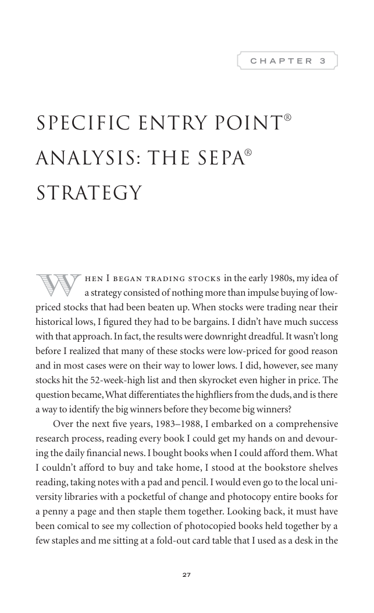

# Trade Like a Stock Market Wizard - Page Image 42

## Source Page

Book: [[Trade Like a Stock Market Wizard]]

## Page Read

Tags: visual-concept-page

Concepts: [[Mental Discipline]]

This is a visual teaching page without a clean ticker/date case. The useful work is to read the image as a concept illustration rather than forcing a market-data reconstruction.

## Linked Stock Figures

- No extracted stock-figure case on this page.

## Extracted Page Text Signal

27 C H A P T E R 3 Specific Entry Point ® Analysis: The SEPA ® Strategy W hen I began trading stocks in the early 1980s, my idea of a strategy consisted of nothing more than impulse buying of low- priced stocks that had been beaten up. When stocks were trading near their historical lows, I figured they had to be bargains. I didn’t have much success with that approach. In fact, the results were downright dreadful. It wasn’t long before I realized that many of these stocks were low-priced for good ...

## Manual Study Prompt

- What visual structure is the page trying to make obvious?
- Is the lesson about buying, avoiding, selling, or managing risk?
- If a ticker is not present, what generic behavior does the image teach?
- If a ticker is present, does the linked OHLCV rebuild confirm the same behavior?
