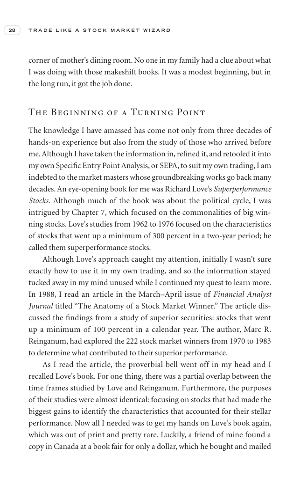

# Trade Like a Stock Market Wizard - Page Image 43

## Source Page

Book: [[Trade Like a Stock Market Wizard]]

## Page Read

Tags: visual-concept-page

Concepts: [[Mental Discipline]]

This is a visual teaching page without a clean ticker/date case. The useful work is to read the image as a concept illustration rather than forcing a market-data reconstruction.

## Linked Stock Figures

- No extracted stock-figure case on this page.

## Extracted Page Text Signal

28 T R A D E L I K E A S T O C K M A R K E T W I Z A R D corner of mother’s dining room. No one in my family had a clue about what I was doing with those makeshift books. It was a modest beginning, but in the long run, it got the job done. The Beginning of a Turning Point The knowledge I have amassed has come not only from three decades of hands-on experience but also from the study of those who arrived before me. Although I have taken the information in, refined it, and retooled it into my own S...

## Manual Study Prompt

- What visual structure is the page trying to make obvious?
- Is the lesson about buying, avoiding, selling, or managing risk?
- If a ticker is not present, what generic behavior does the image teach?
- If a ticker is present, does the linked OHLCV rebuild confirm the same behavior?
