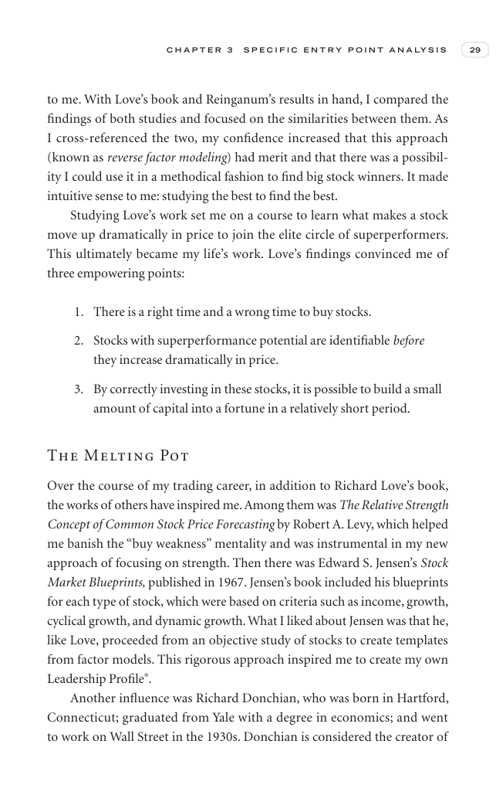

# Trade Like a Stock Market Wizard - Page Image 44

## Source Page

Book: [[Trade Like a Stock Market Wizard]]

## Page Read

Tags: relative-strength, visual-concept-page

Concepts: [[Mental Discipline]], [[Relative Strength Leadership]]

This is a visual teaching page without a clean ticker/date case. The useful work is to read the image as a concept illustration rather than forcing a market-data reconstruction.

## Linked Stock Figures

- No extracted stock-figure case on this page.

## Extracted Page Text Signal

C H A P T E R 3 S P E C I F I C E N T R Y P O I N T A N A LY S I S 29 to me. With Love’s book and Reinganum’s results in hand, I compared the findings of both studies and focused on the similarities between them. As I cross-referenced the two, my confidence increased that this approach (known as reverse factor modeling) had merit and that there was a possibil- ity I could use it in a methodical fashion to find big stock winners. It made intuitive sense to me: studying the best to find the best. Stud...

## Manual Study Prompt

- What visual structure is the page trying to make obvious?
- Is the lesson about buying, avoiding, selling, or managing risk?
- If a ticker is not present, what generic behavior does the image teach?
- If a ticker is present, does the linked OHLCV rebuild confirm the same behavior?
