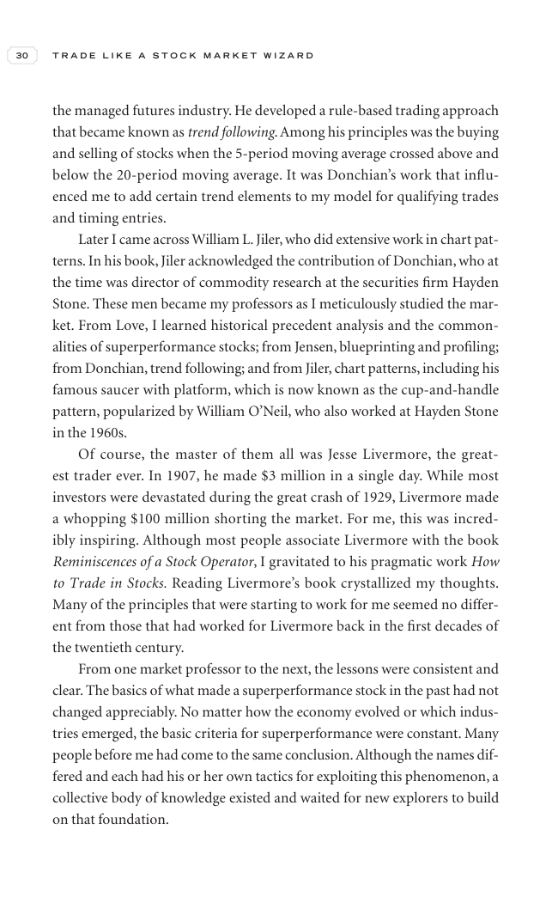

# Trade Like a Stock Market Wizard - Page Image 45

## Source Page

Book: [[Trade Like a Stock Market Wizard]]

## Page Read

Tags: sell-or-failure, visual-concept-page

Concepts: [[Mental Discipline]], [[Sell Rules and Failure Signals]]

This is a visual teaching page without a clean ticker/date case. The useful work is to read the image as a concept illustration rather than forcing a market-data reconstruction.

## Linked Stock Figures

- No extracted stock-figure case on this page.

## Extracted Page Text Signal

30 T R A D E L I K E A S T O C K M A R K E T W I Z A R D the managed futures industry. He developed a rule-based trading approach that became known as trend following. Among his principles was the buying and selling of stocks when the 5-period moving average crossed above and below the 20-period moving average. It was Donchian’s work that influ- enced me to add certain trend elements to my model for qualifying trades and timing entries. Later I came across William L. Jiler, who did extensive work...

## Manual Study Prompt

- What visual structure is the page trying to make obvious?
- Is the lesson about buying, avoiding, selling, or managing risk?
- If a ticker is not present, what generic behavior does the image teach?
- If a ticker is present, does the linked OHLCV rebuild confirm the same behavior?
