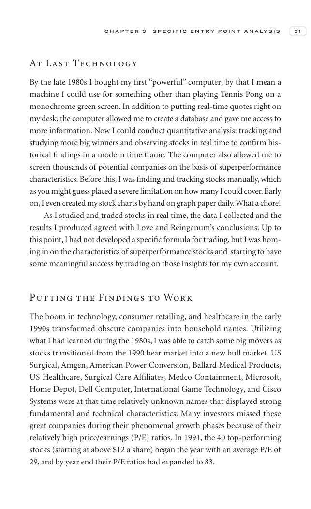

# Trade Like a Stock Market Wizard - Page Image 46

## Source Page

Book: [[Trade Like a Stock Market Wizard]]

## Page Read

Tags: visual-concept-page

Concepts: [[Mental Discipline]]

This is a visual teaching page without a clean ticker/date case. The useful work is to read the image as a concept illustration rather than forcing a market-data reconstruction.

## Linked Stock Figures

- No extracted stock-figure case on this page.

## Extracted Page Text Signal

C H A P T E R 3 S P E C I F I C E N T R Y P O I N T A N A LY S I S 31 At Last Technology By the late 1980s I bought my first “powerful” computer; by that I mean a machine I could use for something other than playing Tennis Pong on a monochrome green screen. In addition to putting real-time quotes right on my desk, the computer allowed me to create a database and gave me access to more information. Now I could conduct quantitative analysis: tracking and studying more big winners and observing stoc...

## Manual Study Prompt

- What visual structure is the page trying to make obvious?
- Is the lesson about buying, avoiding, selling, or managing risk?
- If a ticker is not present, what generic behavior does the image teach?
- If a ticker is present, does the linked OHLCV rebuild confirm the same behavior?
