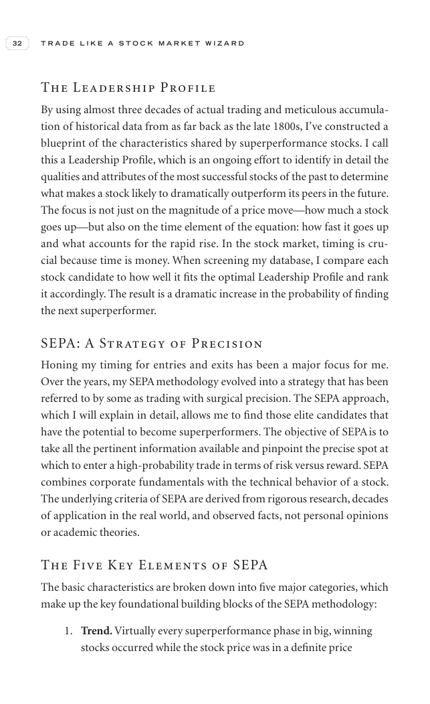

# Trade Like a Stock Market Wizard - Page Image 47

## Source Page

Book: [[Trade Like a Stock Market Wizard]]

## Page Read

Tags: risk-first, visual-concept-page

Concepts: [[Mental Discipline]], [[Risk First]]

This is a visual teaching page without a clean ticker/date case. The useful work is to read the image as a concept illustration rather than forcing a market-data reconstruction.

## Linked Stock Figures

- No extracted stock-figure case on this page.

## Extracted Page Text Signal

32 T R A D E L I K E A S T O C K M A R K E T W I Z A R D The Leadership Profile By using almost three decades of actual trading and meticulous accumula- tion of historical data from as far back as the late 1800s, I’ve constructed a blueprint of the characteristics shared by superperformance stocks. I call this a Leadership Profile, which is an ongoing effort to identify in detail the qualities and attributes of the most successful stocks of the past to determine what makes a stock likely to drama...

## Manual Study Prompt

- What visual structure is the page trying to make obvious?
- Is the lesson about buying, avoiding, selling, or managing risk?
- If a ticker is not present, what generic behavior does the image teach?
- If a ticker is present, does the linked OHLCV rebuild confirm the same behavior?
