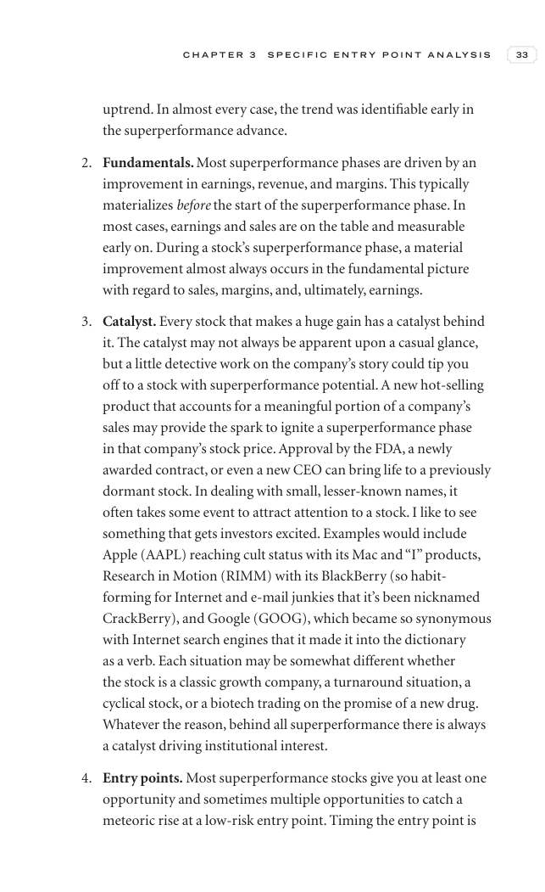

# Trade Like a Stock Market Wizard - Page Image 48

## Source Page

Book: [[Trade Like a Stock Market Wizard]]

## Page Read

Tags: sell-or-failure, visual-concept-page

Concepts: [[Mental Discipline]], [[Sell Rules and Failure Signals]]

This is a visual teaching page without a clean ticker/date case. The useful work is to read the image as a concept illustration rather than forcing a market-data reconstruction.

## Linked Stock Figures

- No extracted stock-figure case on this page.

## Extracted Page Text Signal

C H A P T E R 3 S P E C I F I C E N T R Y P O I N T A N A LY S I S 33 uptrend. In almost every case, the trend was identifiable early in the superperformance advance. 2. Fundamentals. Most superperformance phases are driven by an improvement in earnings, revenue, and margins. This typically materializes before the start of the superperformance phase. In most cases, earnings and sales are on the table and measurable early on. During a stock’s superperformance phase, a material improvement almost a...

## Manual Study Prompt

- What visual structure is the page trying to make obvious?
- Is the lesson about buying, avoiding, selling, or managing risk?
- If a ticker is not present, what generic behavior does the image teach?
- If a ticker is present, does the linked OHLCV rebuild confirm the same behavior?
