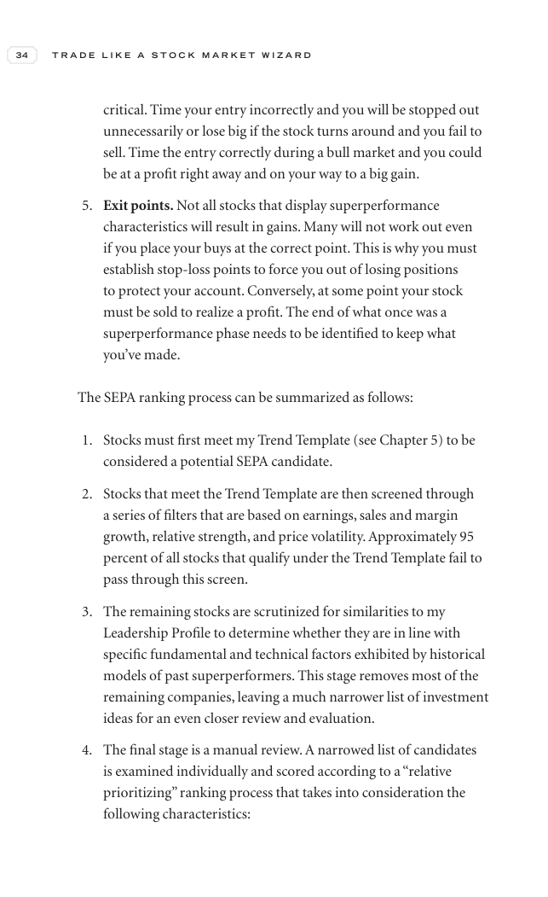

# Trade Like a Stock Market Wizard - Page Image 49

## Source Page

Book: [[Trade Like a Stock Market Wizard]]

## Page Read

Tags: relative-strength, risk-first, sell-or-failure, trend-template, visual-concept-page

Concepts: [[Mental Discipline]], [[Relative Strength Leadership]], [[Risk First]], [[Sell Rules and Failure Signals]], [[Trend Template]]

This is a visual teaching page without a clean ticker/date case. The useful work is to read the image as a concept illustration rather than forcing a market-data reconstruction.

## Linked Stock Figures

- No extracted stock-figure case on this page.

## Extracted Page Text Signal

34 T R A D E L I K E A S T O C K M A R K E T W I Z A R D critical. Time your entry incorrectly and you will be stopped out unnecessarily or lose big if the stock turns around and you fail to sell. Time the entry correctly during a bull market and you could be at a profit right away and on your way to a big gain. 5. Exit points. Not all stocks that display superperformance characteristics will result in gains. Many will not work out even if you place your buys at the correct point. This is why you...

## Manual Study Prompt

- What visual structure is the page trying to make obvious?
- Is the lesson about buying, avoiding, selling, or managing risk?
- If a ticker is not present, what generic behavior does the image teach?
- If a ticker is present, does the linked OHLCV rebuild confirm the same behavior?
