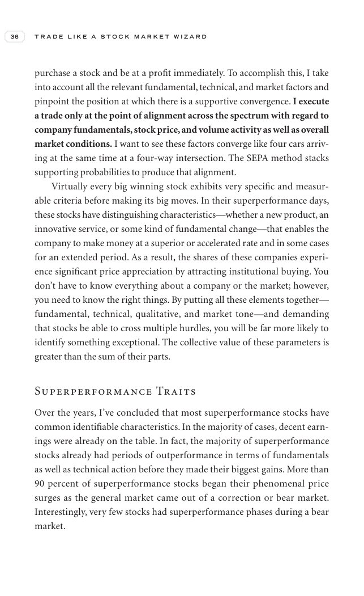

# Trade Like a Stock Market Wizard - Page Image 51

## Source Page

Book: [[Trade Like a Stock Market Wizard]]

## Page Read

Tags: visual-concept-page, volume-behavior

Concepts: [[Mental Discipline]], [[Volume Dry-Up and Accumulation]]

This is a visual teaching page without a clean ticker/date case. The useful work is to read the image as a concept illustration rather than forcing a market-data reconstruction.

## Linked Stock Figures

- No extracted stock-figure case on this page.

## Extracted Page Text Signal

36 T R A D E L I K E A S T O C K M A R K E T W I Z A R D purchase a stock and be at a profit immediately. To accomplish this, I take into account all the relevant fundamental, technical, and market factors and pinpoint the position at which there is a supportive convergence. I execute a trade only at the point of alignment across the spectrum with regard to company fundamentals, stock price, and volume activity as well as overall market conditions. I want to see these factors converge like four c...

## Manual Study Prompt

- What visual structure is the page trying to make obvious?
- Is the lesson about buying, avoiding, selling, or managing risk?
- If a ticker is not present, what generic behavior does the image teach?
- If a ticker is present, does the linked OHLCV rebuild confirm the same behavior?
