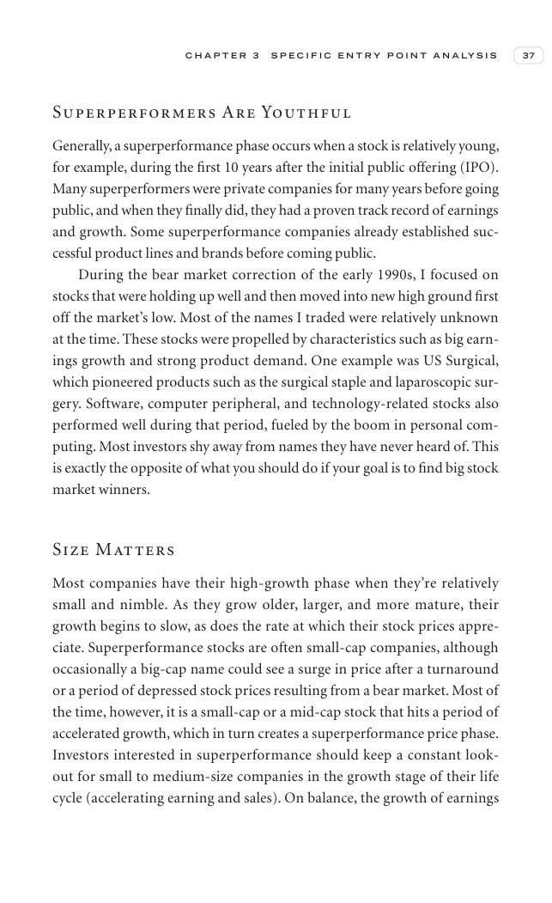

# Trade Like a Stock Market Wizard - Page Image 52

## Source Page

Book: [[Trade Like a Stock Market Wizard]]

## Page Read

Tags: ipo-or-new-issue, visual-concept-page

Concepts: [[IPO Base New Issue Setup|IPO Base / New Issue Setup]], [[Mental Discipline]]

This is a visual teaching page without a clean ticker/date case. The useful work is to read the image as a concept illustration rather than forcing a market-data reconstruction.

## Linked Stock Figures

- No extracted stock-figure case on this page.

## Extracted Page Text Signal

C H A P T E R 3 S P E C I F I C E N T R Y P O I N T A N A LY S I S 37 Superperformers Are Youthful Generally, a superperformance phase occurs when a stock is relatively young, for example, during the first 10 years after the initial public offering (IPO). Many superperformers were private companies for many years before going public, and when they finally did, they had a proven track record of earnings and growth. Some superperformance companies already established suc- cessful product lines and b...

## Manual Study Prompt

- What visual structure is the page trying to make obvious?
- Is the lesson about buying, avoiding, selling, or managing risk?
- If a ticker is not present, what generic behavior does the image teach?
- If a ticker is present, does the linked OHLCV rebuild confirm the same behavior?
