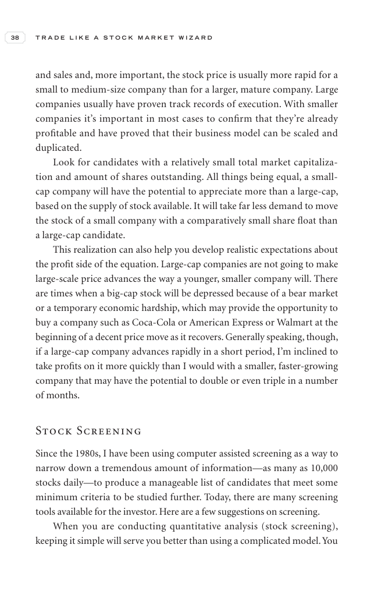

# Trade Like a Stock Market Wizard - Page Image 53

## Source Page

Book: [[Trade Like a Stock Market Wizard]]

## Page Read

Tags: visual-concept-page

Concepts: [[Mental Discipline]]

This is a visual teaching page without a clean ticker/date case. The useful work is to read the image as a concept illustration rather than forcing a market-data reconstruction.

## Linked Stock Figures

- No extracted stock-figure case on this page.

## Extracted Page Text Signal

38 T R A D E L I K E A S T O C K M A R K E T W I Z A R D and sales and, more important, the stock price is usually more rapid for a small to medium-size company than for a larger, mature company. Large companies usually have proven track records of execution. With smaller companies it’s important in most cases to confirm that they’re already profitable and have proved that their business model can be scaled and duplicated. Look for candidates with a relatively small total market capitaliza- tion a...

## Manual Study Prompt

- What visual structure is the page trying to make obvious?
- Is the lesson about buying, avoiding, selling, or managing risk?
- If a ticker is not present, what generic behavior does the image teach?
- If a ticker is present, does the linked OHLCV rebuild confirm the same behavior?
