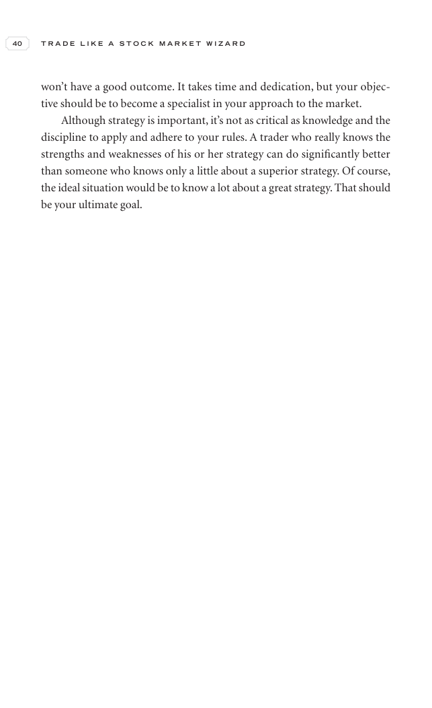

# Trade Like a Stock Market Wizard - Page Image 55

## Source Page

Book: [[Trade Like a Stock Market Wizard]]

## Page Read

Tags: mental-discipline, visual-concept-page

Concepts: [[Mental Discipline]]

This is a visual teaching page without a clean ticker/date case. The useful work is to read the image as a concept illustration rather than forcing a market-data reconstruction.

## Linked Stock Figures

- No extracted stock-figure case on this page.

## Extracted Page Text Signal

40 T R A D E L I K E A S T O C K M A R K E T W I Z A R D won’t have a good outcome. It takes time and dedication, but your objec- tive should be to become a specialist in your approach to the market. Although strategy is important, it’s not as critical as knowledge and the discipline to apply and adhere to your rules. A trader who really knows the strengths and weaknesses of his or her strategy can do significantly better than someone who knows only a little about a superior strategy. Of course, ...

## Manual Study Prompt

- What visual structure is the page trying to make obvious?
- Is the lesson about buying, avoiding, selling, or managing risk?
- If a ticker is not present, what generic behavior does the image teach?
- If a ticker is present, does the linked OHLCV rebuild confirm the same behavior?
