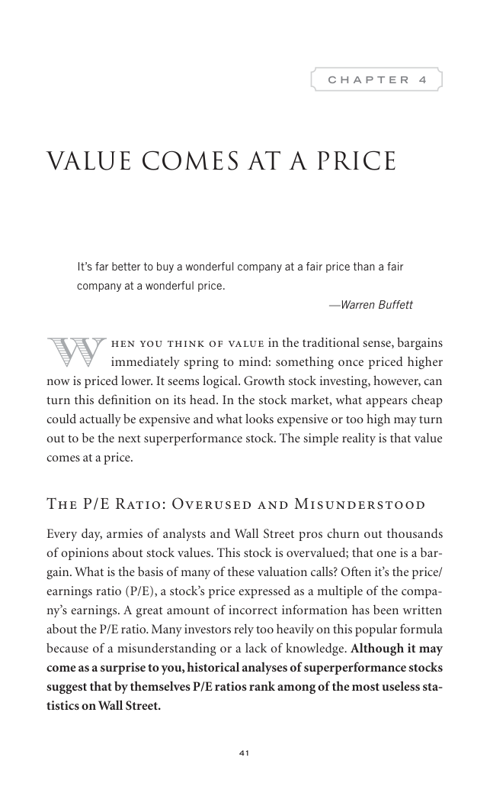

# Trade Like a Stock Market Wizard - Page Image 56

## Source Page

Book: [[Trade Like a Stock Market Wizard]]

## Page Read

Tags: visual-concept-page

Concepts: [[Mental Discipline]]

This is a visual teaching page without a clean ticker/date case. The useful work is to read the image as a concept illustration rather than forcing a market-data reconstruction.

## Linked Stock Figures

- No extracted stock-figure case on this page.

## Extracted Page Text Signal

41 C H A P T E R 4 Value Comes at a Price It’s far better to buy a wonderful company at a fair price than a fair company at a wonderful price. -Warren Buffett W hen you think of value in the traditional sense, bargains immediately spring to mind: something once priced higher now is priced lower. It seems logical. Growth stock investing, however, can turn this definition on its head. In the stock market, what appears cheap could actually be expensive and what looks expensive or too high may turn o...

## Manual Study Prompt

- What visual structure is the page trying to make obvious?
- Is the lesson about buying, avoiding, selling, or managing risk?
- If a ticker is not present, what generic behavior does the image teach?
- If a ticker is present, does the linked OHLCV rebuild confirm the same behavior?
