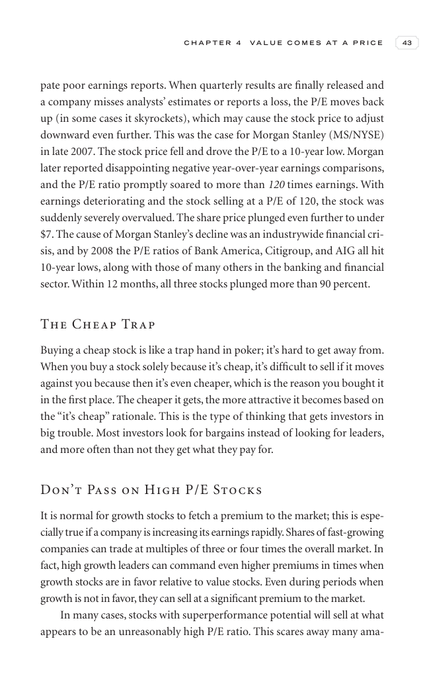

# Trade Like a Stock Market Wizard - Page Image 58

## Source Page

Book: [[Trade Like a Stock Market Wizard]]

## Page Read

Tags: sell-or-failure, visual-concept-page

Concepts: [[Mental Discipline]], [[Sell Rules and Failure Signals]]

This is a visual teaching page without a clean ticker/date case. The useful work is to read the image as a concept illustration rather than forcing a market-data reconstruction.

## Linked Stock Figures

- No extracted stock-figure case on this page.

## Extracted Page Text Signal

C H A P T E R 4 V A L U E C O M E S A T A P R I C E 43 pate poor earnings reports. When quarterly results are finally released and a company misses analysts’ estimates or reports a loss, the P/E moves back up (in some cases it skyrockets), which may cause the stock price to adjust downward even further. This was the case for Morgan Stanley (MS/NYSE) in late 2007. The stock price fell and drove the P/E to a 10-year low. Morgan later reported disappointing negative year-over-year earnings compariso...

## Manual Study Prompt

- What visual structure is the page trying to make obvious?
- Is the lesson about buying, avoiding, selling, or managing risk?
- If a ticker is not present, what generic behavior does the image teach?
- If a ticker is present, does the linked OHLCV rebuild confirm the same behavior?
