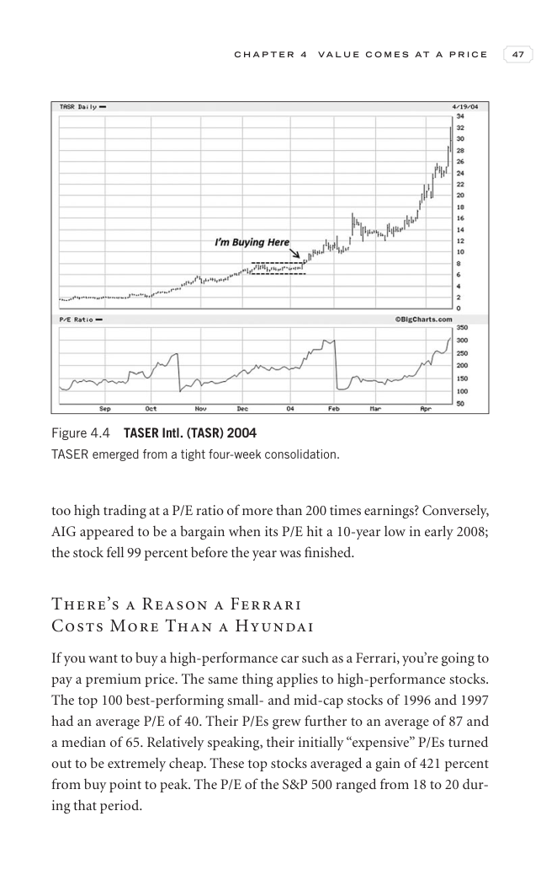

# Trade Like a Stock Market Wizard - Page Image 62

## Source Page

Book: [[Trade Like a Stock Market Wizard]]

## Page Read

Tags: manual-review-needed, stock-chart-page

Concepts: [[Mental Discipline]]

This page contains one or more stock-chart figures already reconciled in the stock-image layer. Study the source page first for the visual lesson, then open the linked case notes to compare it against rebuilt OHLCV data.

## Linked Stock Figures

- [[Trade Like a Stock Market Wizard - Figure 4-4 - TASR - page 62]] - TASR - manual-review-needed

## Extracted Page Text Signal

C H A P T E R 4 V A L U E C O M E S A T A P R I C E 47 too high trading at a P/E ratio of more than 200 times earnings? Conversely, AIG appeared to be a bargain when its P/E hit a 10-year low in early 2008; the stock fell 99 percent before the year was finished. There’s a Reason a Ferrari Costs More Than a Hyundai If you want to buy a high-performance car such as a Ferrari, you’re going to pay a premium price. The same thing applies to high-performance stocks. The top 100 best-performing small- a...

## Manual Study Prompt

- What visual structure is the page trying to make obvious?
- Is the lesson about buying, avoiding, selling, or managing risk?
- If a ticker is not present, what generic behavior does the image teach?
- If a ticker is present, does the linked OHLCV rebuild confirm the same behavior?
