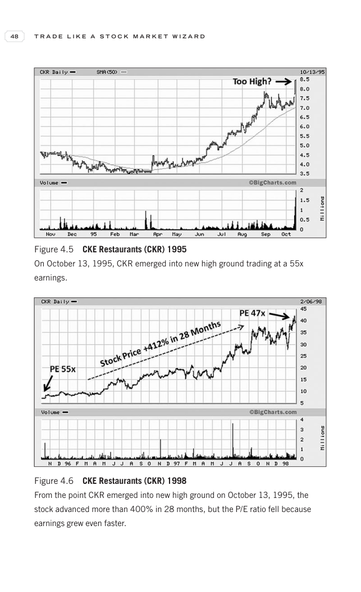

# Trade Like a Stock Market Wizard - Page Image 63

## Source Page

Book: [[Trade Like a Stock Market Wizard]]

## Page Read

Tags: manual-review-needed, stock-chart-page

Concepts: [[Mental Discipline]]

This page contains one or more stock-chart figures already reconciled in the stock-image layer. Study the source page first for the visual lesson, then open the linked case notes to compare it against rebuilt OHLCV data.

## Linked Stock Figures

- [[Trade Like a Stock Market Wizard - Figure 4-5 - CKR - page 63]] - CKR - manual-review-needed
- [[Trade Like a Stock Market Wizard - Figure 4-6 - CKR - page 63]] - CKR - manual-review-needed

## Extracted Page Text Signal

48 T R A D E L I K E A S T O C K M A R K E T W I Z A R D Figure 4.5 CKE Restaurants (CKR) 1995 On October 13, 1995, CKR emerged into new high ground trading at a 55x earnings. Figure 4.6 CKE Restaurants (CKR) 1998 From the point CKR emerged into new high ground on October 13, 1995, the stock advanced more than 400% in 28 months, but the P/E ratio fell because earnings grew even faster

## Manual Study Prompt

- What visual structure is the page trying to make obvious?
- Is the lesson about buying, avoiding, selling, or managing risk?
- If a ticker is not present, what generic behavior does the image teach?
- If a ticker is present, does the linked OHLCV rebuild confirm the same behavior?
