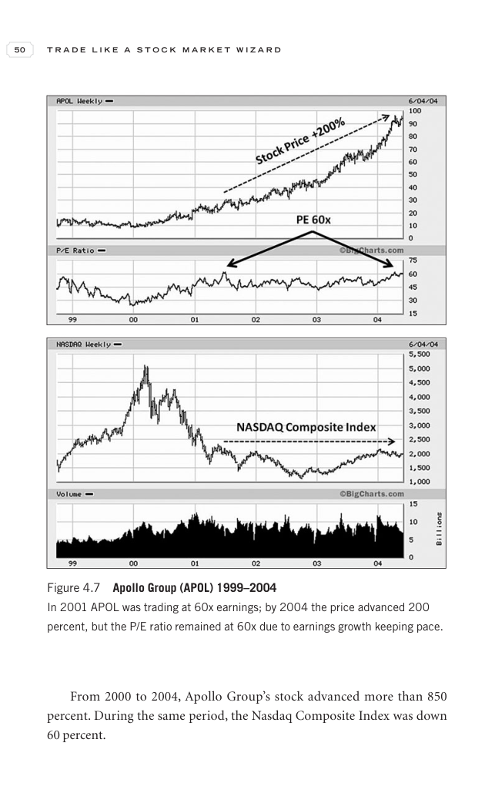

# Trade Like a Stock Market Wizard - Page Image 65

## Source Page

Book: [[Trade Like a Stock Market Wizard]]

## Page Read

Tags: manual-review-needed, stock-chart-page

Concepts: [[Mental Discipline]]

This page contains one or more stock-chart figures already reconciled in the stock-image layer. Study the source page first for the visual lesson, then open the linked case notes to compare it against rebuilt OHLCV data.

## Linked Stock Figures

- [[Trade Like a Stock Market Wizard - Figure 4-7 - APOL - page 65]] - APOL - manual-review-needed

## Extracted Page Text Signal

50 T R A D E L I K E A S T O C K M A R K E T W I Z A R D From 2000 to 2004, Apollo Group’s stock advanced more than 850 percent. During the same period, the Nasdaq Composite Index was down 60 percent. Figure 4.7 Apollo Group (APOL) 1999-2004 In 2001 APOL was trading at 60x earnings; by 2004 the price advanced 200 percent, but the P/E ratio remained at 60x due to earnings growth keeping pace

## Manual Study Prompt

- What visual structure is the page trying to make obvious?
- Is the lesson about buying, avoiding, selling, or managing risk?
- If a ticker is not present, what generic behavior does the image teach?
- If a ticker is present, does the linked OHLCV rebuild confirm the same behavior?
