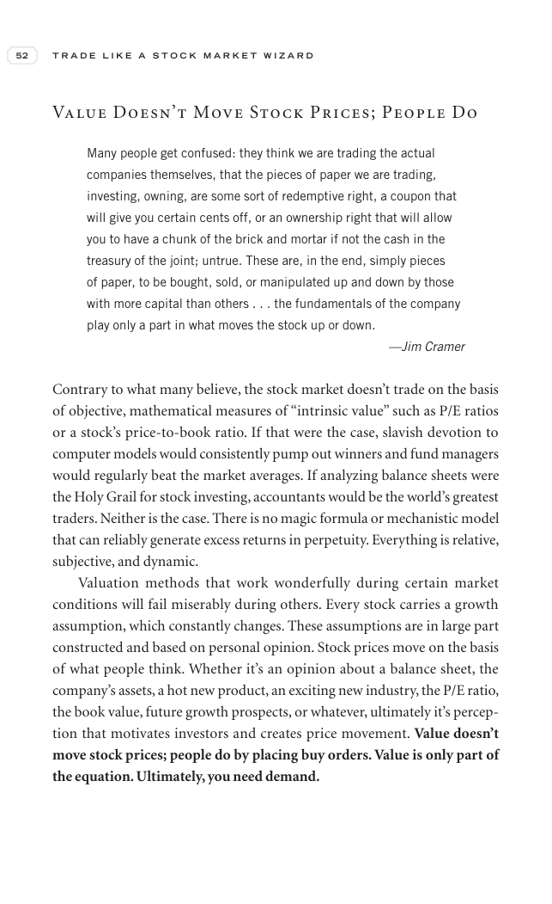

# Trade Like a Stock Market Wizard - Page Image 67

## Source Page

Book: [[Trade Like a Stock Market Wizard]]

## Page Read

Tags: visual-concept-page

Concepts: [[Mental Discipline]]

This is a visual teaching page without a clean ticker/date case. The useful work is to read the image as a concept illustration rather than forcing a market-data reconstruction.

## Linked Stock Figures

- No extracted stock-figure case on this page.

## Extracted Page Text Signal

52 T R A D E L I K E A S T O C K M A R K E T W I Z A R D Value Doesn’t Move Stock Prices; People Do Many people get confused: they think we are trading the actual companies themselves, that the pieces of paper we are trading, investing, owning, are some sort of redemptive right, a coupon that will give you certain cents off, or an ownership right that will allow you to have a chunk of the brick and mortar if not the cash in the treasury of the joint; untrue. These are, in the end, simply pieces ...

## Manual Study Prompt

- What visual structure is the page trying to make obvious?
- Is the lesson about buying, avoiding, selling, or managing risk?
- If a ticker is not present, what generic behavior does the image teach?
- If a ticker is present, does the linked OHLCV rebuild confirm the same behavior?
