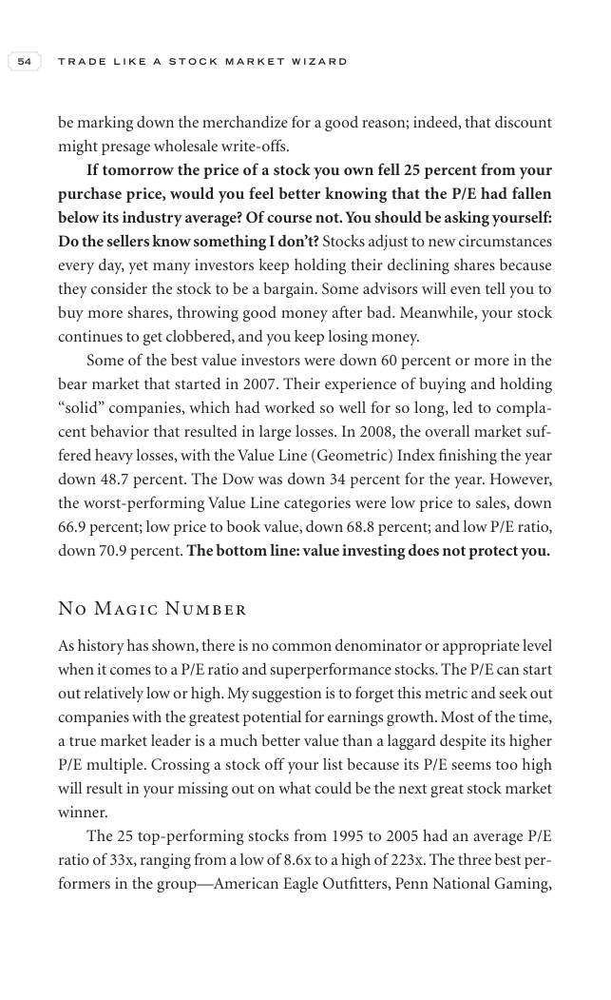

# Trade Like a Stock Market Wizard - Page Image 69

## Source Page

Book: [[Trade Like a Stock Market Wizard]]

## Page Read

Tags: sell-or-failure, visual-concept-page

Concepts: [[Mental Discipline]], [[Sell Rules and Failure Signals]]

This is a visual teaching page without a clean ticker/date case. The useful work is to read the image as a concept illustration rather than forcing a market-data reconstruction.

## Linked Stock Figures

- No extracted stock-figure case on this page.

## Extracted Page Text Signal

54 T R A D E L I K E A S T O C K M A R K E T W I Z A R D be marking down the merchandize for a good reason; indeed, that discount might presage wholesale write-offs. If tomorrow the price of a stock you own fell 25 percent from your purchase price, would you feel better knowing that the P/E had fallen below its industry average? Of course not. You should be asking yourself: Do the sellers know something I don’t? Stocks adjust to new circumstances every day, yet many investors keep holding their ...

## Manual Study Prompt

- What visual structure is the page trying to make obvious?
- Is the lesson about buying, avoiding, selling, or managing risk?
- If a ticker is not present, what generic behavior does the image teach?
- If a ticker is present, does the linked OHLCV rebuild confirm the same behavior?
